# Create Cache in Local

## Create Cache Manager
1. open wm administrator page
2. click settings -> caching \
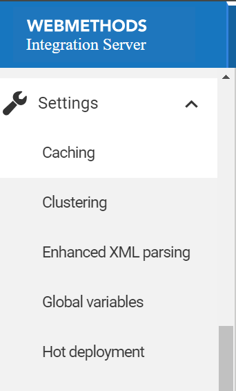
3. click add cache manager \
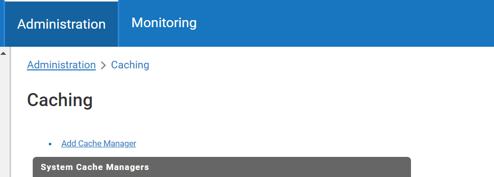
4. let's name it `cache.local.test` -> click `save changes`
5. the created cache managers will be shown in `public cache managers` table. click `start`
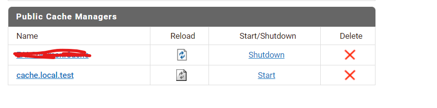
6. open the `cache.local.test` 
7. click add cache \
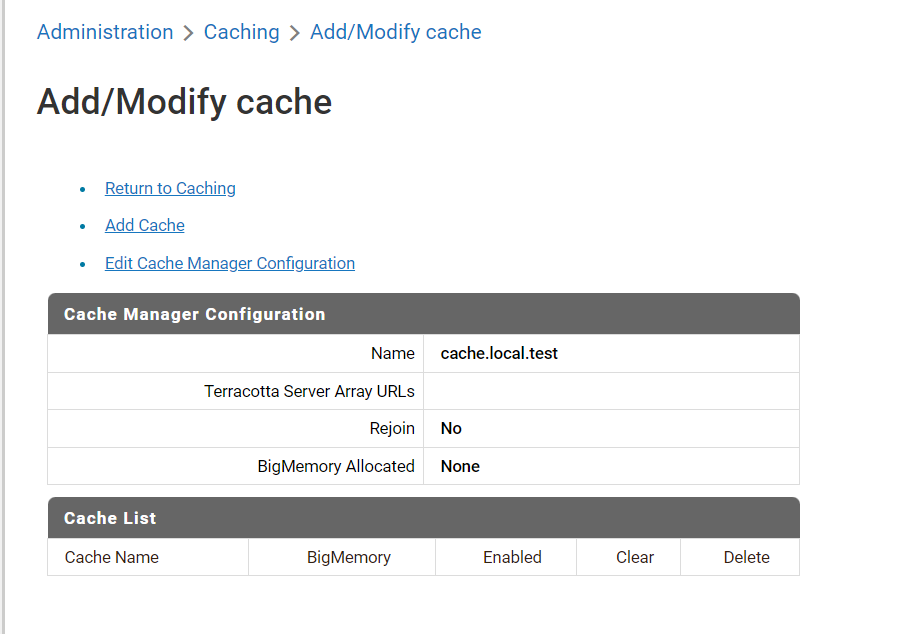
8. let's name the cache name as `cache-test`, `Maximum Elements in Memory` = 100, set `time to live` to `120`, then click `save changes`
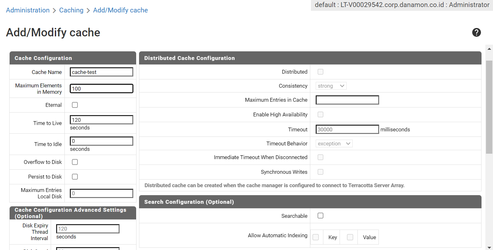

## Set the value to the cache
1. create a map to create a `value` lets define it `test-cache` and `key` with value `key-cache` \
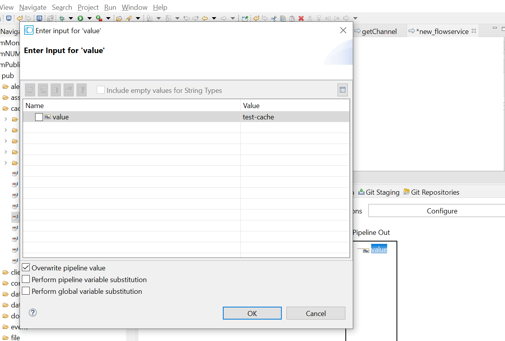
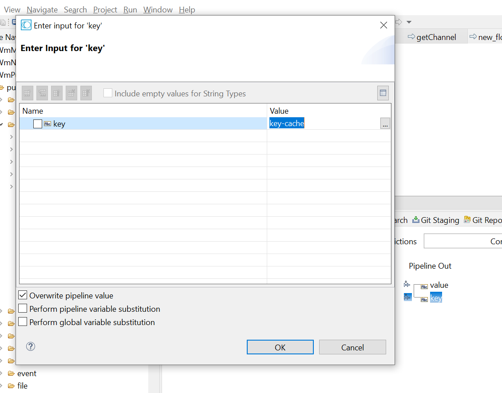
2. put the cache using `pub.cache:put` with this configuration
- `cacheManagerName` : `cache.local.test` (cache manager that we created previously)
- `cacheName` : `cache-test` (cache name that we created previously)
- `value` : `value`
- `key` : `key`
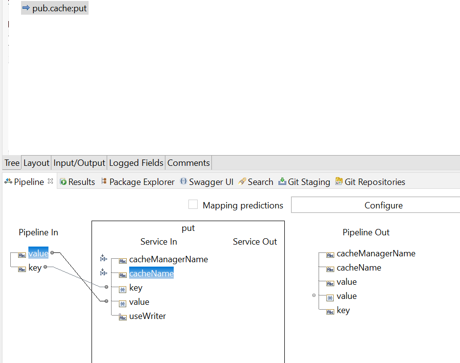

## Get the value from the cache
1. create map step to create a `key` with value `key-cache`
2. get the cache using `pub.cache:get` with this configuration
- `cacheManagerName` : `cache.local.test` (cache manager that we created previously)
- `cacheName` : `cache-test` (cache name that we created previously)
- `value` : `value`
- `key` : `key`
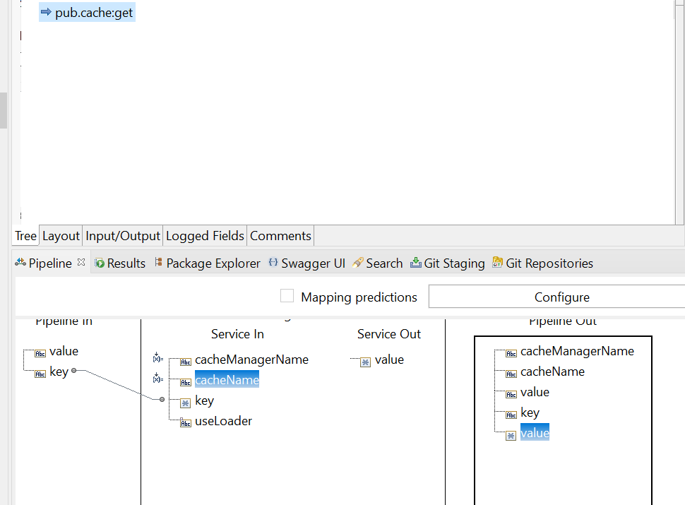

# Test the service
1. run the put cache service
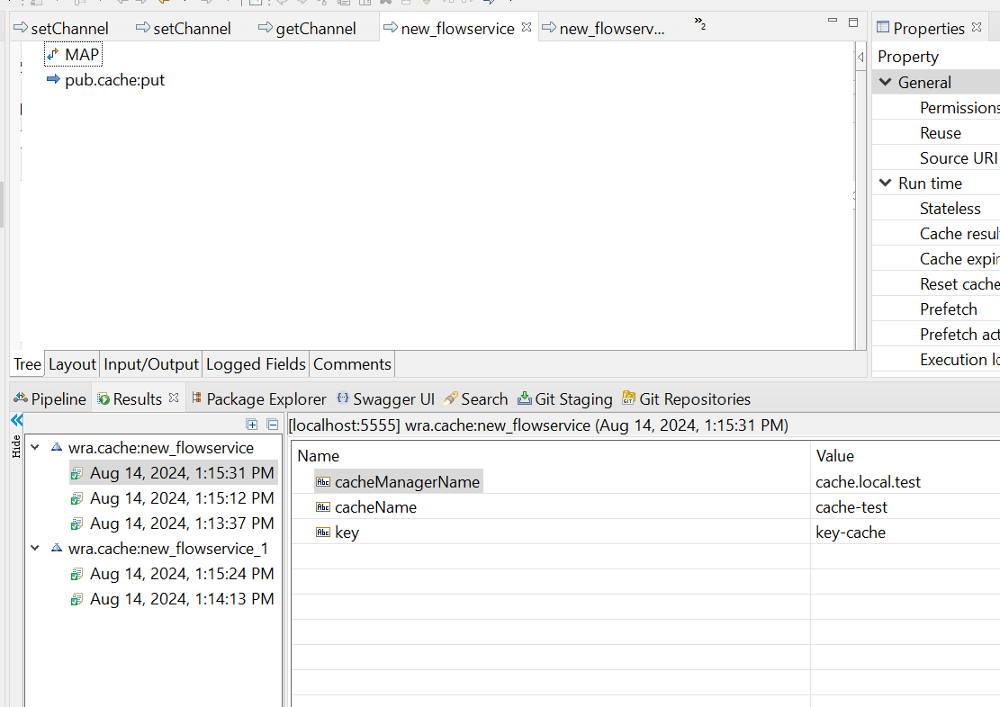
2. run the get cache service
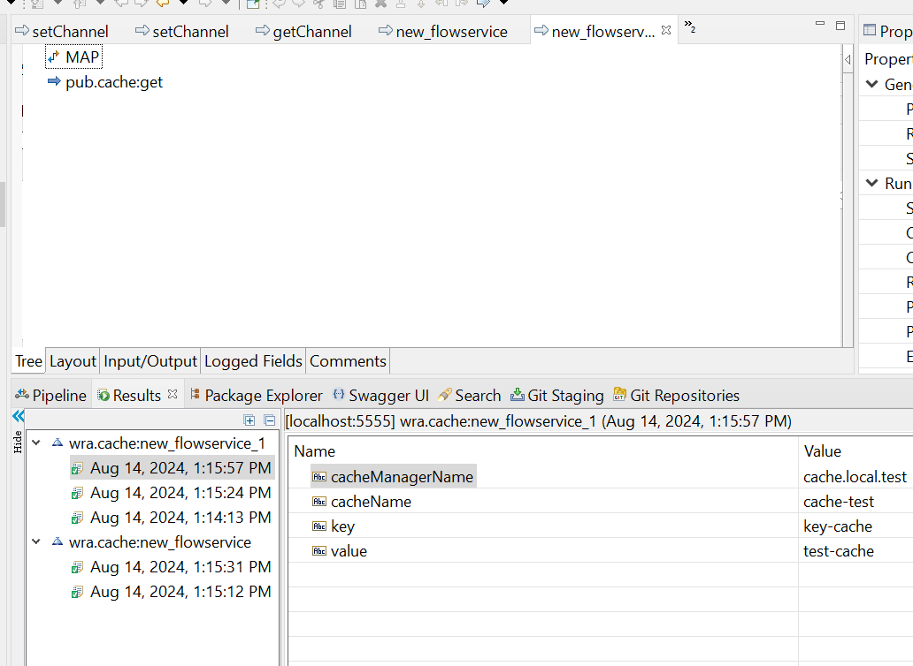

as you can see in the cache, the `value` is get from cache