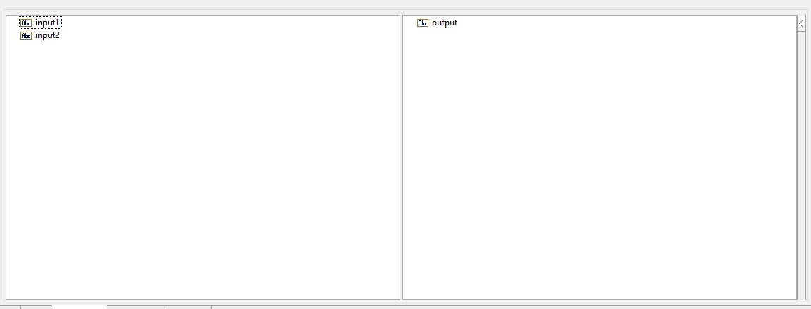
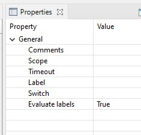
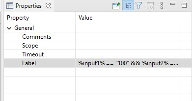
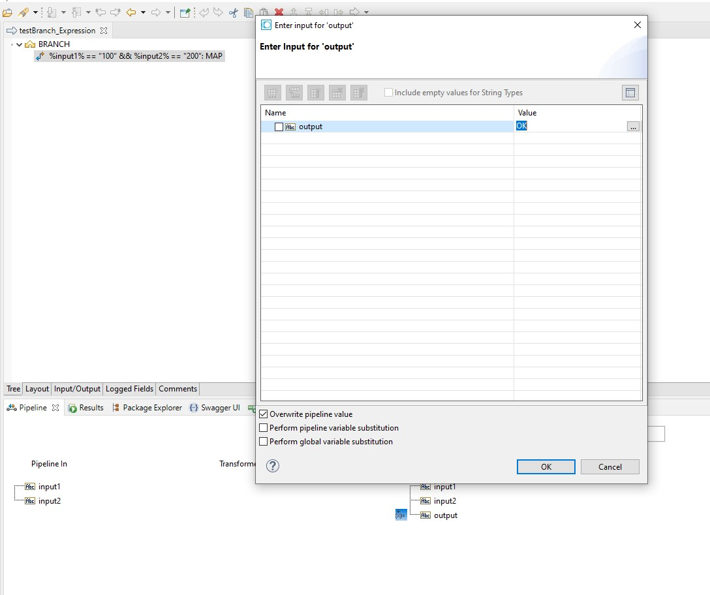
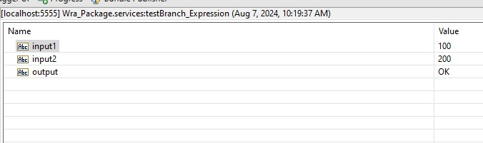

# Example how to use if-else statement in webMethods Integration Server

1. Create a new flow service, let's name it `testBranch_Expression`.
2. Add 2 input variables, `input1` and `input2` of type `String`, and 1 output variable, `output` of type `String`. \

3. Add a `BRANCH` step to the flow service. Then set the `Evaluate Labels` property to `true`. \

4. Add a `MAP` step to the `BRANCH` step. Then set the `Expression` property to `%input1% == "100" && %input2% == "200"`. \

5. In the `MAP` step, set the `output` variable to `OK`. \

6. Save and run the flow service. Set the `input1` to `100` and `input2` to `200`. The output should be `OK`. \
