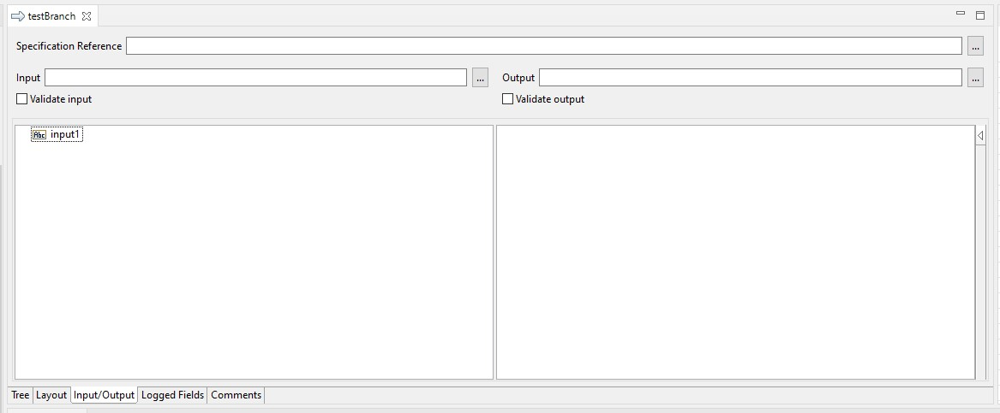
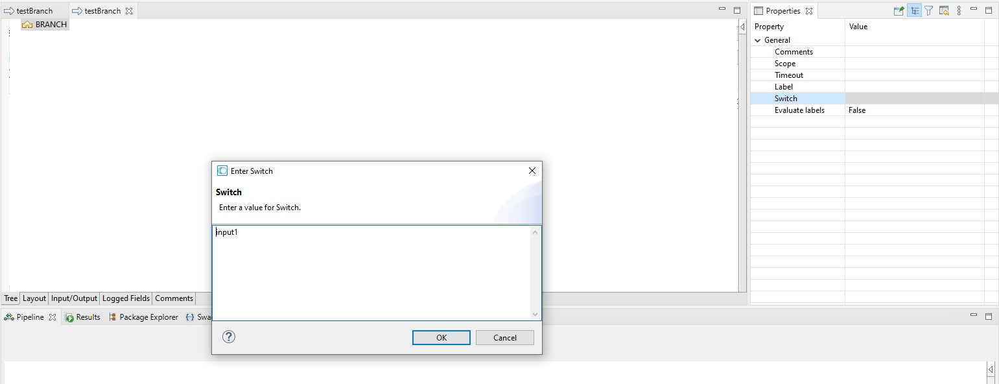
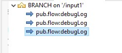
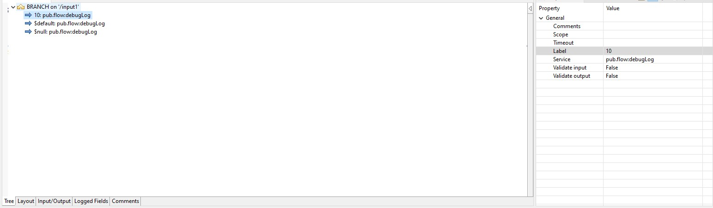

# Example Create Switch Case Condition using Branch

1. Create string for input with the name `input1`

2. Insert BRANCH, add `input1` in the `Switch` Property of BRANCH

3. add 3 pub.flow:debugLog in the branch \

4. In each debugLog set the Label in property. For the first debugLog set the Label to `10`, For the second debugLog set the Label to `$default`, and for the third debugLog set the Label to `$null`. \

The first debugLog will be executed if the input is `10`, the second debugLog will be executed if the input is not `10`, and the third debugLog will be executed if the input is null.