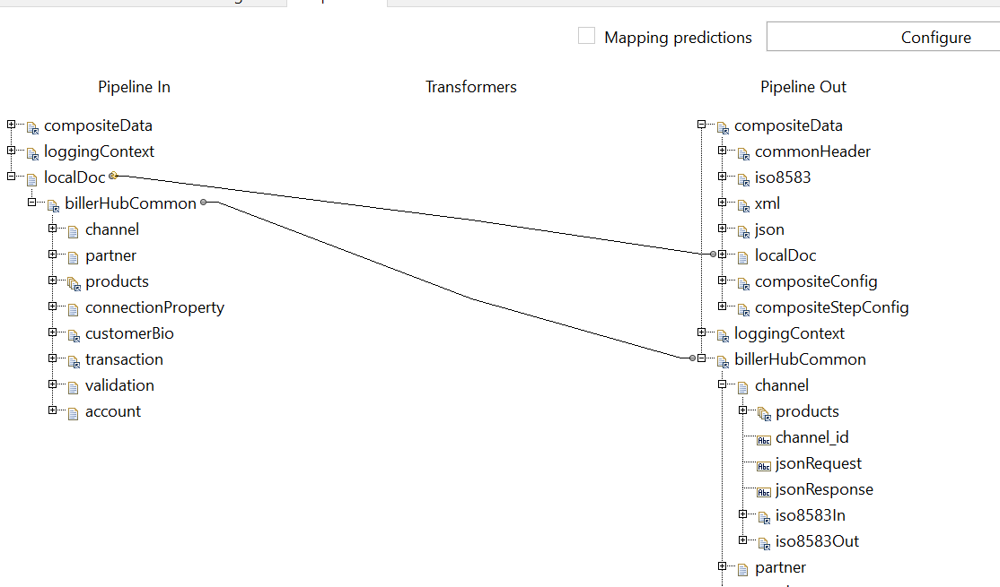
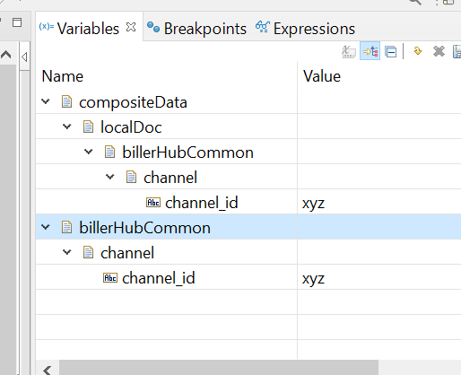
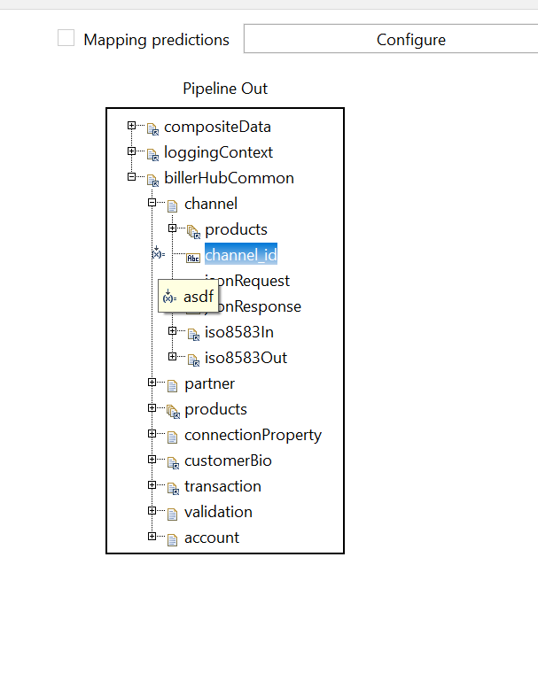
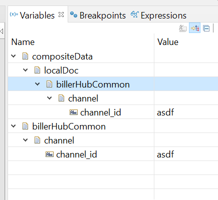

# Doc Reference Behaviour

Doc reference just like pointer, it only contain reference address instead of the full object. So for example `A` and `B` reference to the same pointer, then when we change a value in `A` the value change will be reflected also in `B`

# Example
- in the first step we assigned the `localDoc/billerHubCommon/channel/channel_id` to `xyz`. please be note that the `billerHubCommon/channel/channel_id` is doc reference.

- then we assigned the `localDoc` to `compositeData/localDoc`. and also assigned `billerHubCommon` to a new variable.

- as you can see even though the `localDoc` is dropped as long as there is a variable that ref to the `billerHubCommon` doc reference the value still can be accessed

- the value of `/compositeData/localDoc/billerHubCommon/channel/channel_id` and `/billerHubCommon/channel/channel_id` are still `xyz`.

- in the next step we change the value of `billerHubCommon/channel/channel_id` to `asdf`

- and it will change the value of `channel_id` in `/compositeData/localDoc/billerHubCommon/channel/channel_id` also, because the type of `billerHubCommon` is doc reference.

