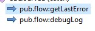
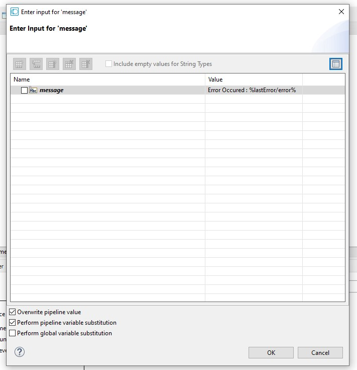

# Get The Last Error

1. Using `pub.flow:getLastError` service, you can get the last error that occurred in the pipeline.
2. Map the last error to `pub.flow:debugLog` service to log the error message. \
 \
