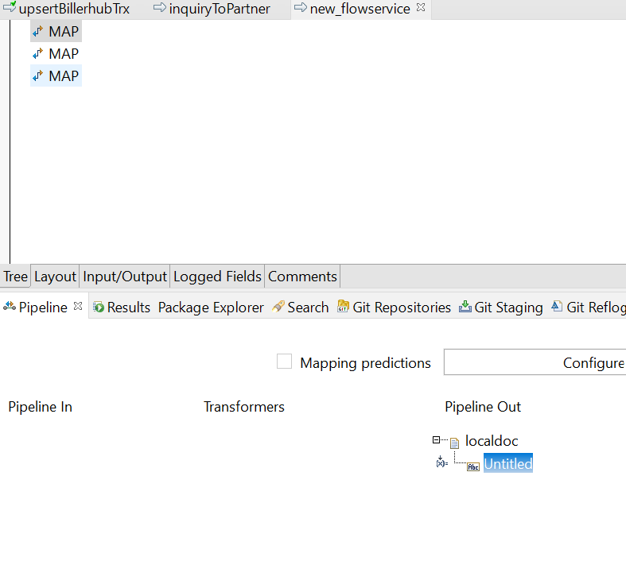
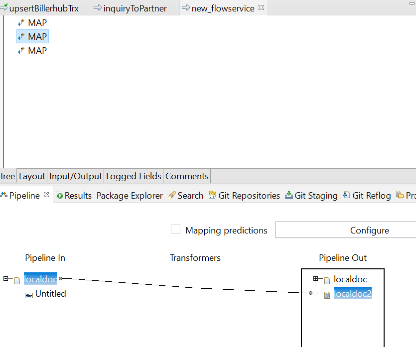
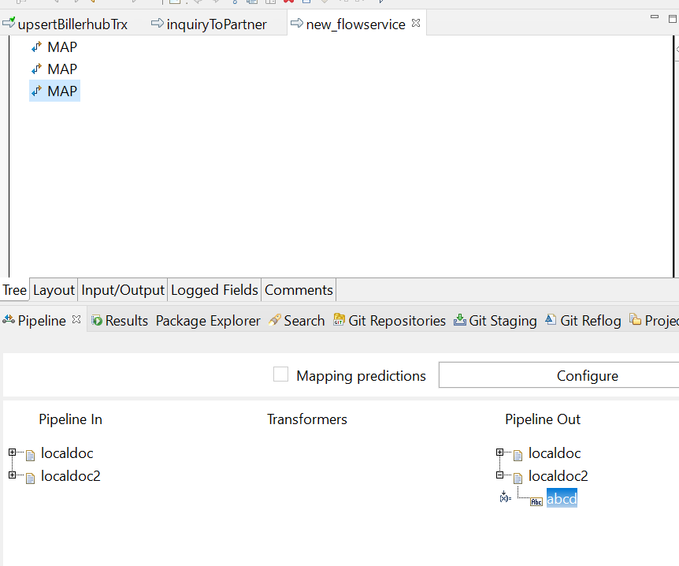
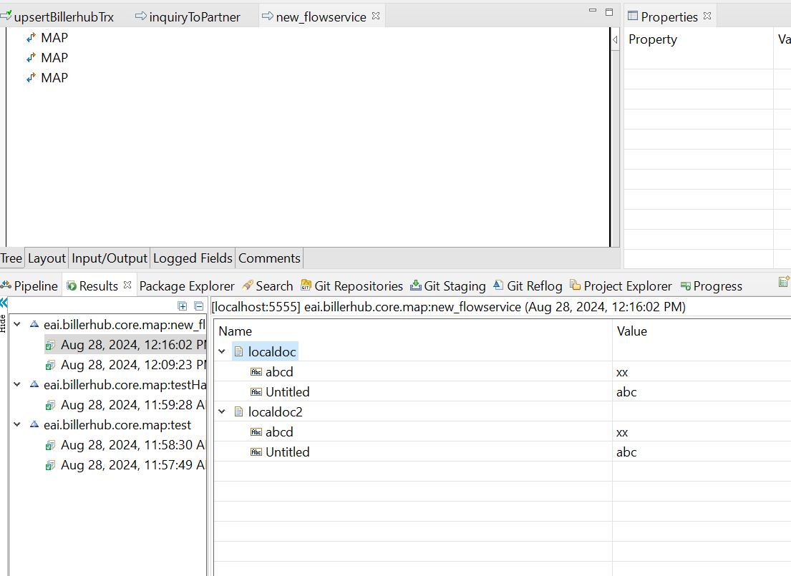

# Document is Reference

## About
When you assign a document to the new document, then the two document are referencing to the same memory.
you can see by look at the following examples

- in the first map create a new document, with one field text

- in the second map, map the first doc to the second doc. now they will share the same reference

- add a new field in the second doc. by doing this, the first doc will have the same value as the second doc,
because it has the same reference.

- here is the result of executed service

as we can see the final result the first and the second doc have the same field and value that proves that
document is reference.