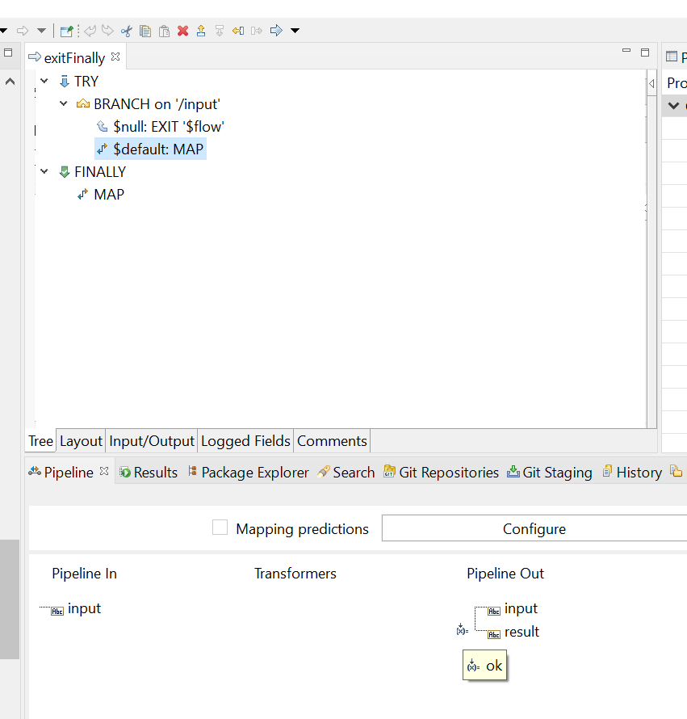
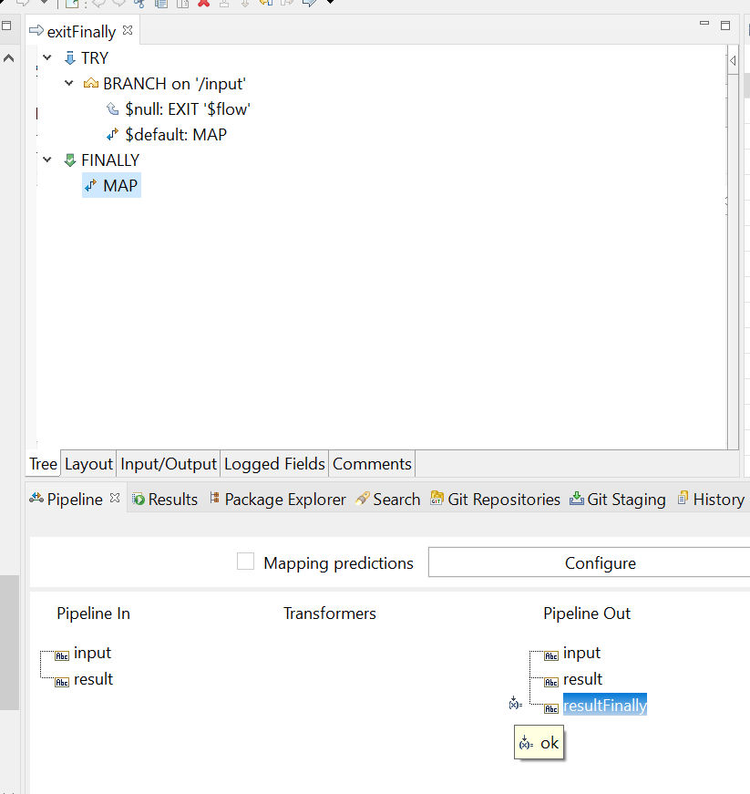
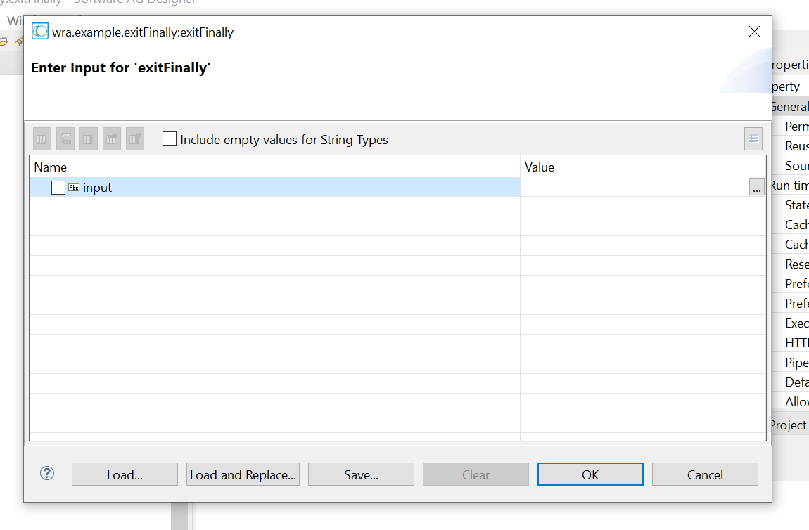
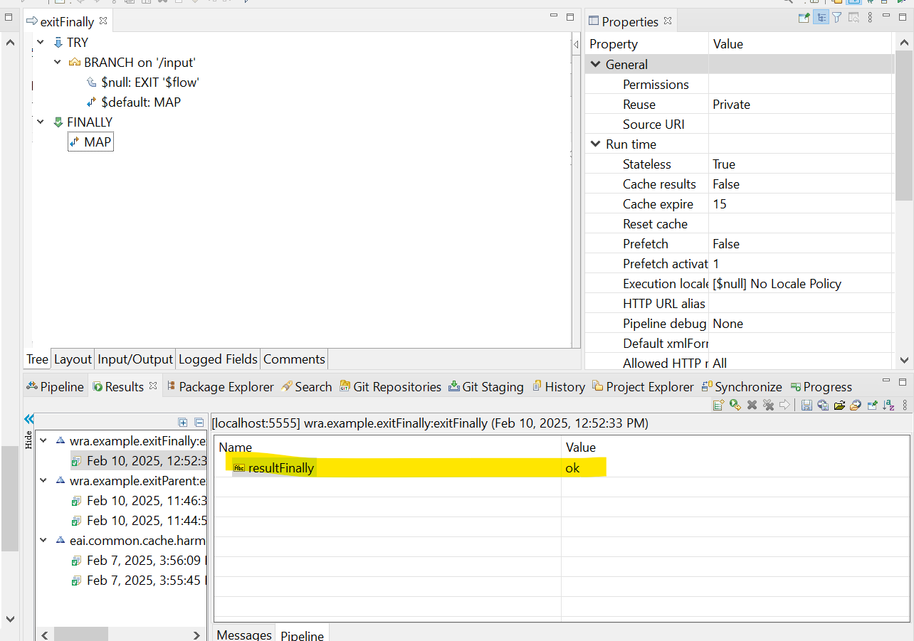
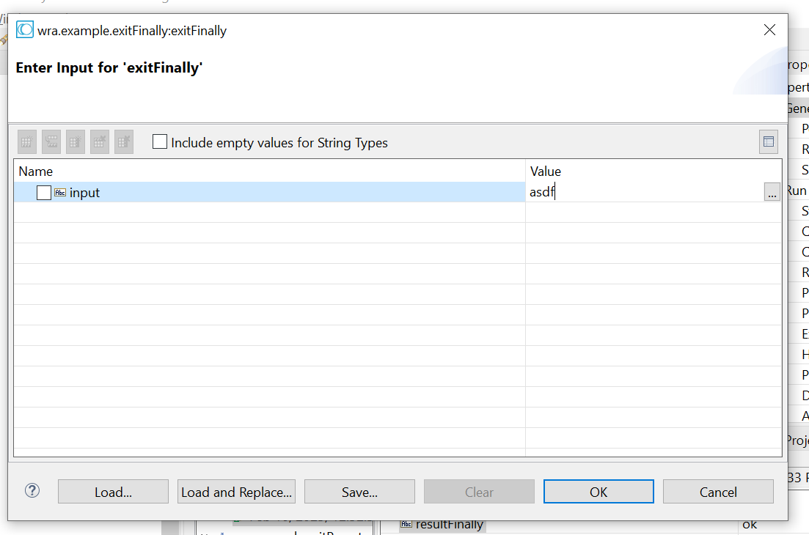
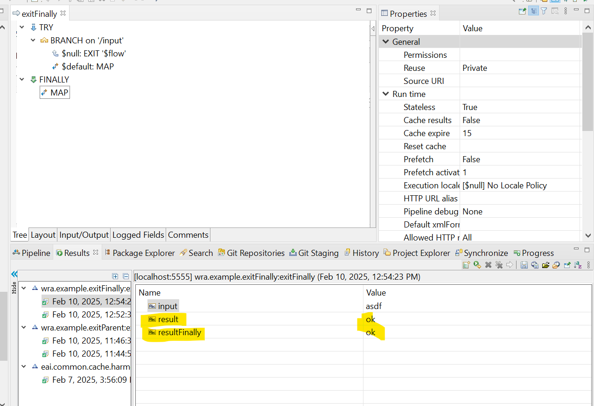

- exit $flow will make flow go out from flow, but if you have a finally then it will go to the finally first
- in here if `input` is empty then we will exit from flow, and continue to finally. 
- else it will set `result` to `ok`

- in finally it will set `resultFinally` = ok

Test
- `input` = `null`

as we can see it only set `resultFinally` because the input is null

- `input` != `null`

