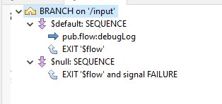
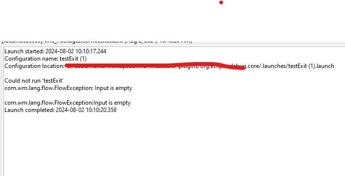
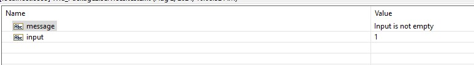

# Return Success or Error Example

In this example, we will create a service that returns a success or error based on the input. We will use the `pub.flow:throwExceptionForRetry` service to throw an exception if the input is empty.

1. Add an Input/Output to the service, and name it `input` and `output` respectively.
2. Add a `Branch` step  and set the `Switch` property to `input`.
3. Add a `Sequence` step to the `Branch` step, and do the following:
    * set the `Label` property of the sequence to `$default`.
    * add a `pub.flow:debugLog` service to the sequence, and set the `Message` property to `Input is not empty`.
    * add `EXIT` step to the sequence, and set the `Signal` property to `SUCCESS` and set `Exit from` property to `$flow`. This will exit the service with a success signal.
4. Add another `Sequence` step to the `Branch` step, and do the following:
    * set the `Label` property of the sequence to `null`.
    * add `EXIT` step to the sequence, and set the `Signal` property to `Failure`, set `Exit from` property to `$flow`, set the `Failure Message` property to `Input is empty`. This will exit the service with a failure signal.
5. The final service should look like this: \

6. Save and run the service. If the input is empty, the service will return an error. \
 \
If the input is not empty, the service will return a success. \
 