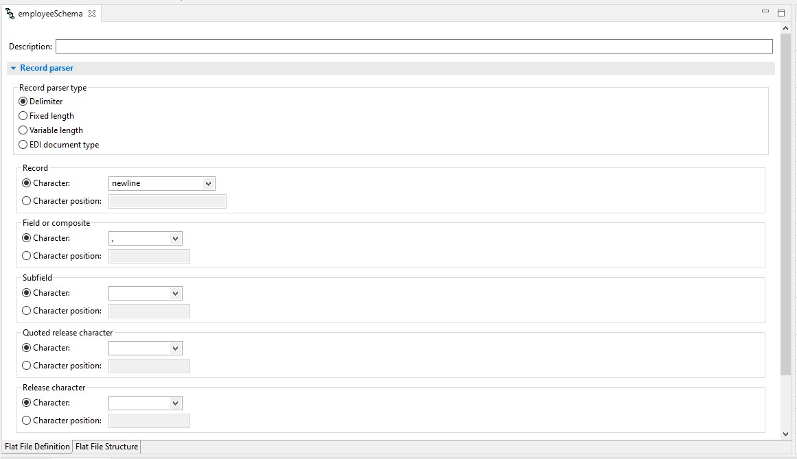
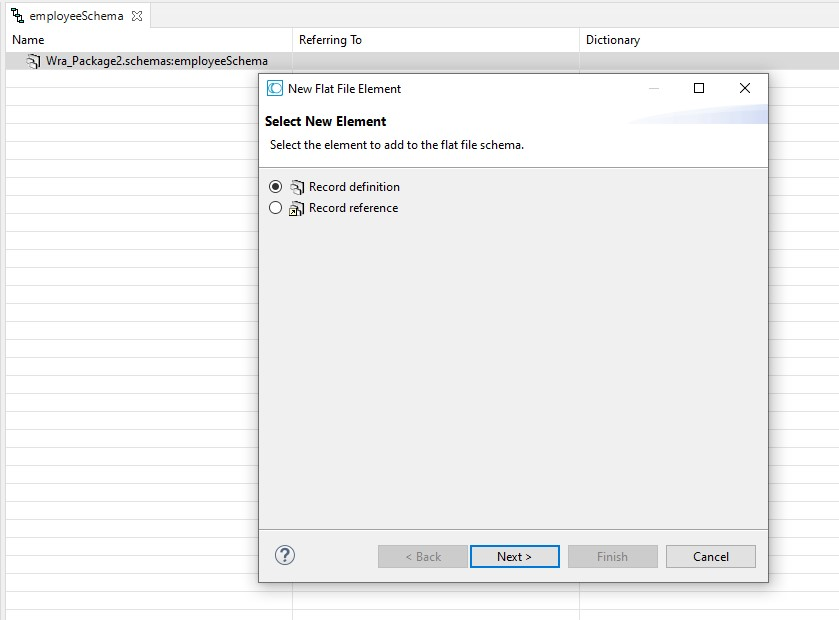
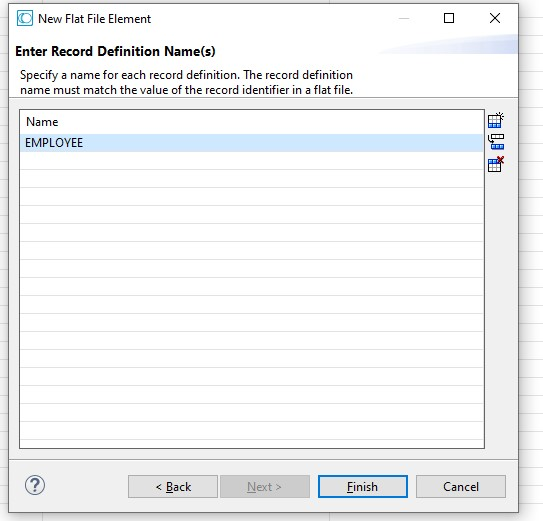
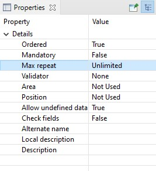
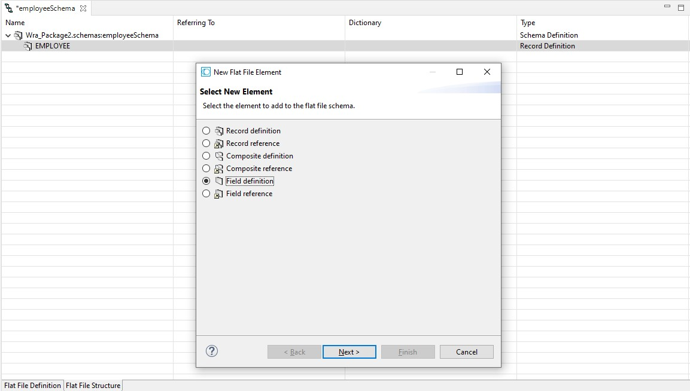
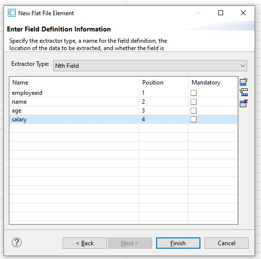
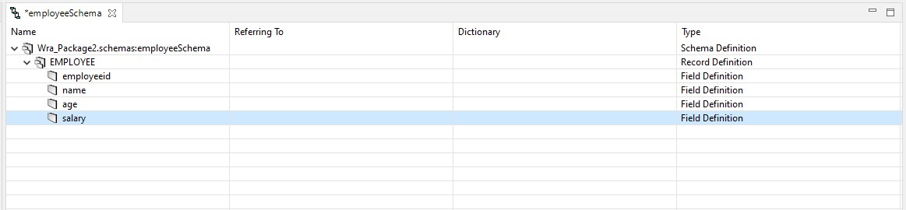
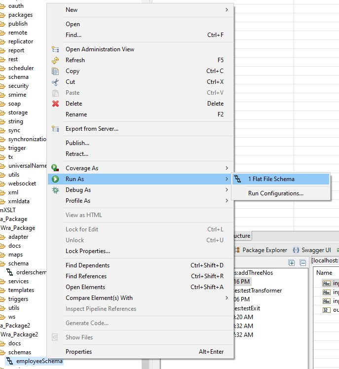
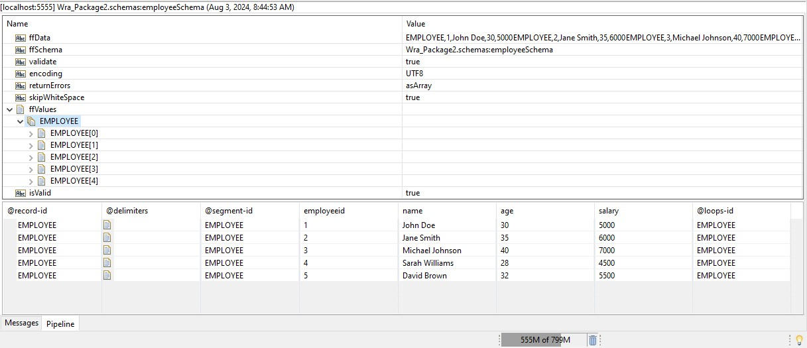

# CSV to Flat File Schema

In this example, we will create a flat file schema from employee flat file. The employee flat file contains the following data:

```flat
EMPLOYEE,1,John Doe,30,5000
EMPLOYEE,2,Jane Smith,35,6000
EMPLOYEE,3,Michael Johnson,40,7000
EMPLOYEE,4,Sarah Williams,28,4500
EMPLOYEE,5,David Brown,32,5500
```

1. Usually you will create a flat file schema in the `schemas` folder of your package

2. Create a new `Flat File Schema` name it `employeeSchema`, then click next

3. Select `Create manually` option, and then click finish

4. In the `Flat File Definition` tab, set the following properties:
   * Record parser type: `Delimiter`
   * Character : `newline`
   * Field or composite : `Character` and set the value to `,`
   * The final configuration should look like this:
     

5. Open the `Flat File Structure` tab, and set the following properties:
   * In the `Name` of schema, right click and select `new`. This will open a new window and select `Record definition` then click `Next` \
   
   * Set the name to `EMPLOYEE` and click `Finish` \
   
   * Set the `Max repeat` property of the created `EMPLOYEE` to `Unlimited` \
   
   * Right click on the `EMPLOYEE` and select `new` then select `Field definition` and click `Next` \
   
   * Set Extractor Type to `Nth Field`, and set the value like this: \
   
   * Click `Finish`, the final configuration should look like this: \
   

6. Save and run the flat file schema to test the configuration by right clicking on the schema -> run as -> flat file schema.
 \
browse the file and select the `employee.csv` file, then click `OK`. The result should look like this:
