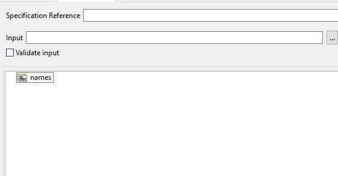
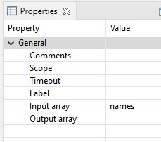
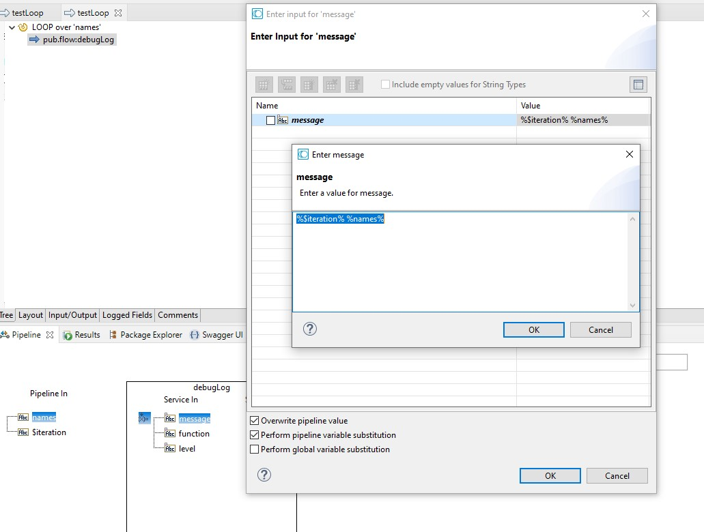
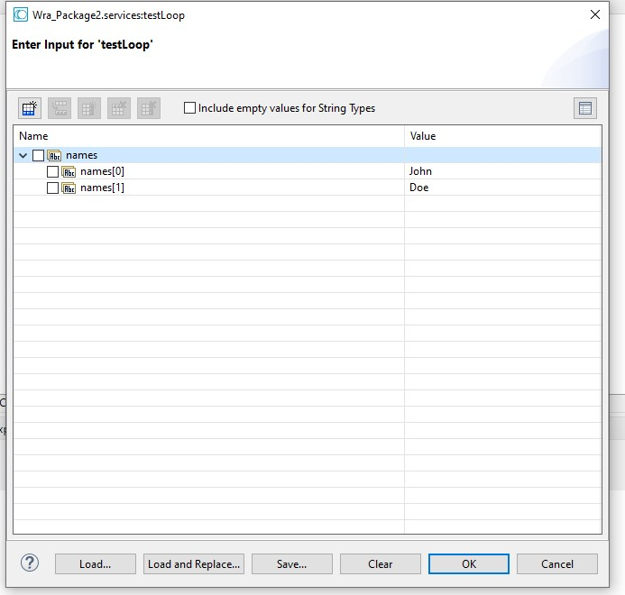
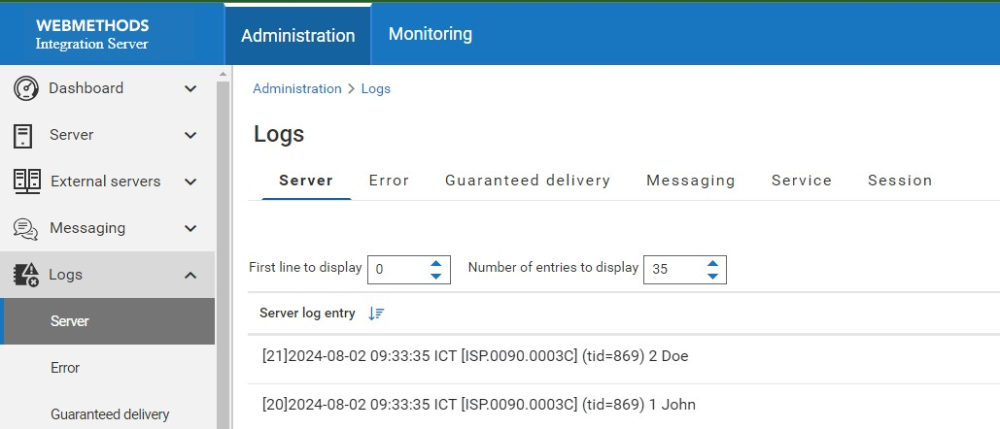

# Loop Example

1. Create a string list as an input, and name it `names` \

2. Add loop, and set `Input Array` property to `names` \

3. Add `pub.flow.debuglog` service, and set `Message` property to `%$iteration% %names%`. Don't forget to check `Perform pipeline variable substitution` checkbox. \

4. Run the service, and check the log in the server log. \
 \
