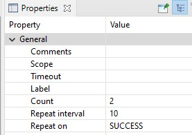
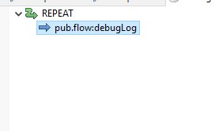

# Repeat

## Use Case
If you want to invoke particular operation multiple times even in success or failure depending on your configuration. For example, you need to send a file to a FTP server and you want to retry the operation in case of failure. \
In this example, we will demonstrate how repeat works on success.

1. Add `REPEAT` and configure the repeat properties.
2. Set the count = 2, repeat interval = 10, repeat on = SUCCESS \

3. Add pub.flow:debuglog to the repeat step to log the message. \
 \
based on the configuration, the debuglog operation will be repeated 2 times with an interval of 10 seconds in case of success.