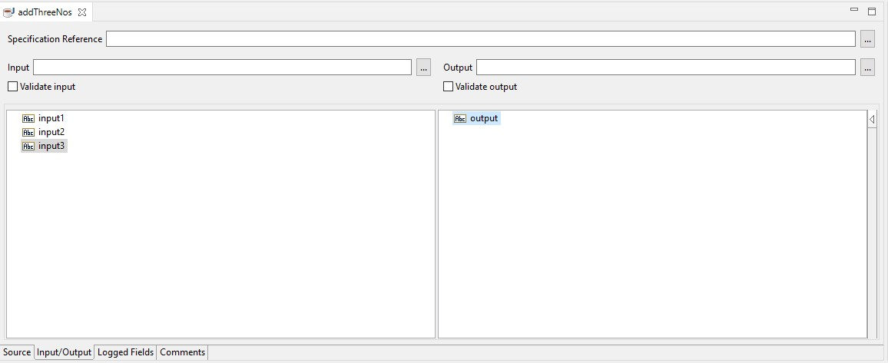
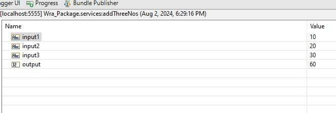

# Example to Get Input and Set Output in Java Service

In this example, we will sum three numbers and return the result.

1. Create a new Java service and name it `SumThreeNumbers`.
2. Add three inputs and one output. Name them `input1`, `input2`, `input3`, and `output` respectively. \

3. Add the following code to the `SumThreeNumbers.java` file:
```java
	public static final void SumThreeNumbers(IData pipeline) throws ServiceException {
		
		// pipeline
        // get the input values
		IDataCursor pipelineCursor = pipeline.getCursor();
			String	input1 = IDataUtil.getString( pipelineCursor, "input1" );
			String	input2 = IDataUtil.getString( pipelineCursor, "input2" );
			String	input3 = IDataUtil.getString( pipelineCursor, "input3" );
		pipelineCursor.destroy();
		
		// write a logic to add three numbers
		int l_int = Integer.parseInt(input1) + Integer.parseInt(input2) + Integer.parseInt(input3);
		Integer l_obj = new Integer(l_int);
		
		// pipeline
        // set the output value
		IDataCursor pipelineCursor_1 = pipeline.getCursor();
		IDataUtil.put( pipelineCursor_1, "output", l_obj );
		pipelineCursor_1.destroy();
		
	}
```
4. Save the service, and run the service with the input values `input1=10`, `input2=20`, and `input3=30`. The service will return the output value `60`. \
