# Publish Messages to Multiple Subscribers

This sample demonstrates how to publish messages to multiple subscribers using universal messaging.

## Create a Publishable Document Type
1. Make sure that the Universal Messaging server is up and running.
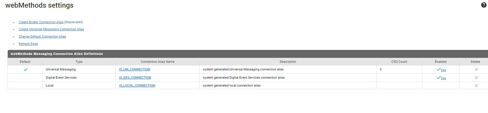
2. Create a new Document Type, let's name it `Employee`.
3. Add the following fields to the `Employee` document type:
   * `id` (String)
   * `name` (String)
   * `age` (String)
   * `salary` (String) \
   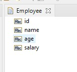
4. Set the `Publishable` property of the `Employee` document type to `true`. \
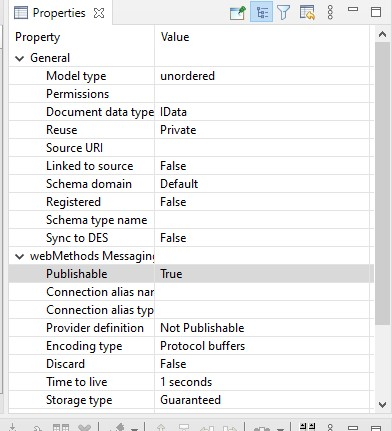 \
The `pub.publish:envelope` will be added to the `Employee` document type automatically. \
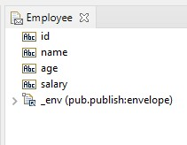

## Publish Messages to Multiple Subscribers
1. Create a new flow service, let's name it `testPublish`.
2. Add the `Employee` document that we created earlier as an input to the `testPublish` flow service, and name it with this format `folderName.docs.doc_name`. In this example  we are going to use `Wra_Package2.docs:Employee` to refer to the `Employee` document type. \
Tips: you can copy the document type and paste it when you rename the input, so you don't have to type it manually. \
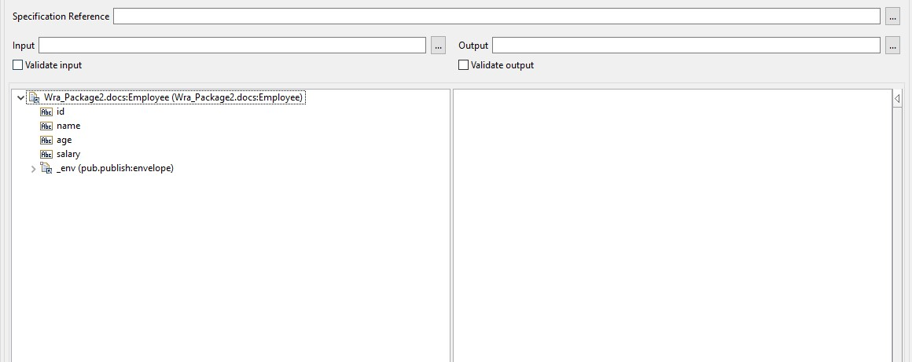
3. Add the `pub.publish:publish` service to the `testPublish` flow service.
4. Set the documentTypeName to `Wra_Package2.docs:Employee`. \
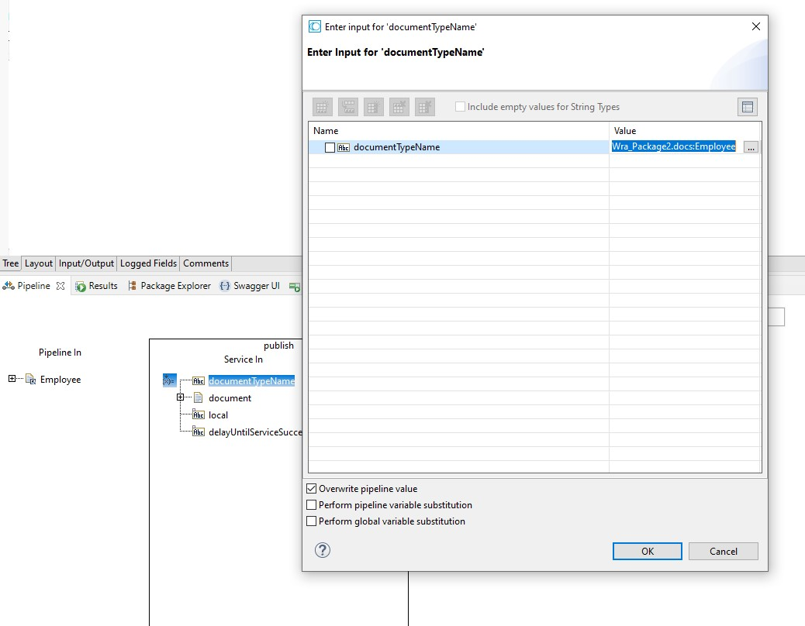 \
**NOTE**: the the `documentTypeName` value should be the same between the publisher and the consumer. It's used to identify the document type that will be published.
5. Drag the `Wra_Package2.docs:Employee` document to the `document` input of the `pub.publish:publish` service. \
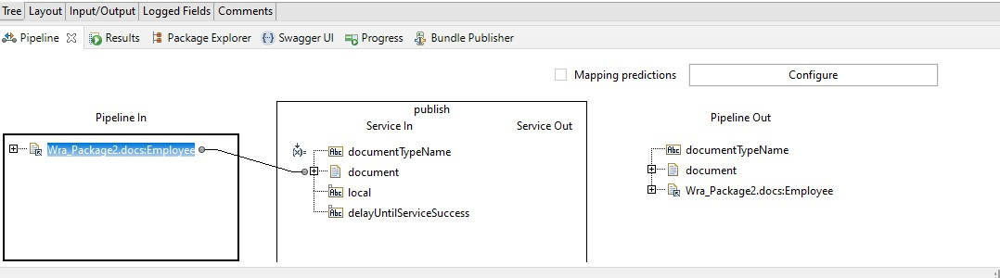
6. Save the `testPublish` flow service.

## Create Multiple Subscribers Services
1. Create a new flow service, let's name it `printEmployee`.
2. Add the `Employee` document that we created earlier as an input to the `printEmployee` flow service, and rename it to `Wra_Package2.docs:Employee`.
3. Add a `pub.flow:debugLog` service to the `printEmployee` flow service, and set the `message` to 
```
SERVICE 1 Employee: Employee: id : %Wra_Package2.docs:Employee/id% ; name : %Wra_Package2.docs:Employee/name%; age: %Wra_Package2.docs:Employee/age%; salary:%Wra_Package2.docs:Employee/salary%
```
Make sure the `Perform pipeline variable substitution` is checked. \
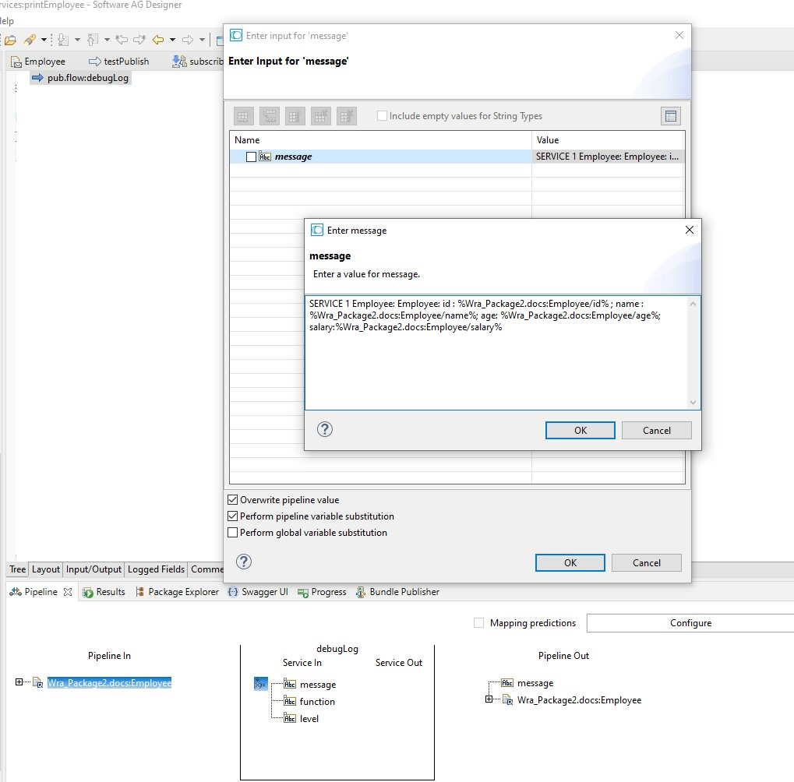 \
save the `printEmployee` flow service.
4. Copy the `printEmployee` flow service and paste it to create a new flow service, let's name it `printEmployee2`.
5. Change the `message` of the `pub.flow:debugLog` service to 
```
SERVICE 2 Employee: Employee: id : %Wra_Package2.docs:Employee/id% ; name : %Wra_Package2.docs:Employee/name%; age: %Wra_Package2.docs:Employee/age%; salary:%Wra_Package2.docs:Employee/salary%
```

## Create Messaging Triggers
1. Create a new `webMethods messaging trigger`, let's name it `subscribeEmployee`.
2. In the `Condition detail` set the `Document Type` to `Employee` document type that we created earlier, and set the `Service` to `printEmployee` flow service. The final configuration should look like this: \
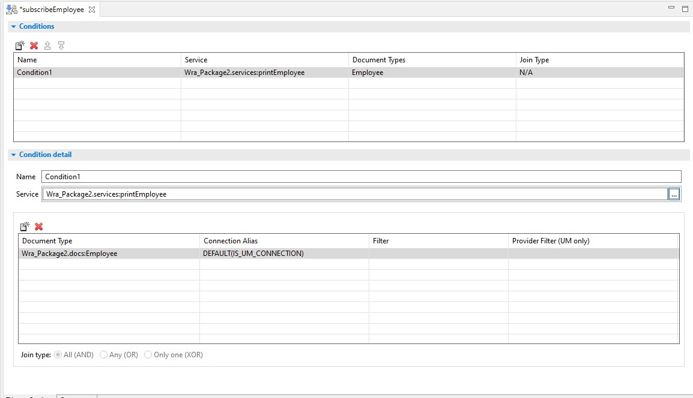
3. Save the `subscribeEmployee` messaging trigger
4. Follow the same steps to create a new `webMethods messaging trigger`, let's name it `subscribeEmployee2`, and set the `Service` to `printEmployee2` flow service.
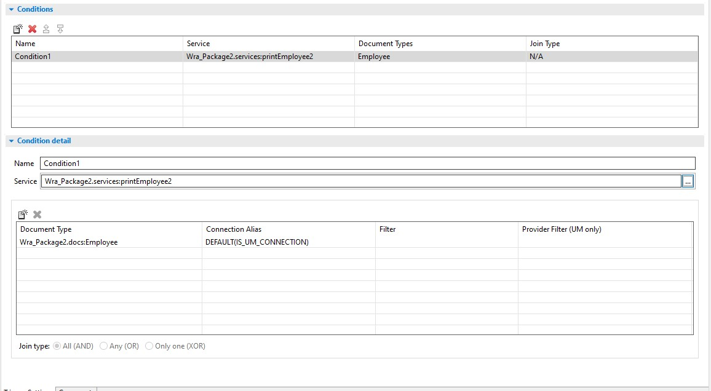

## Publish Messages
1. Run the `testPublish` flow service. \
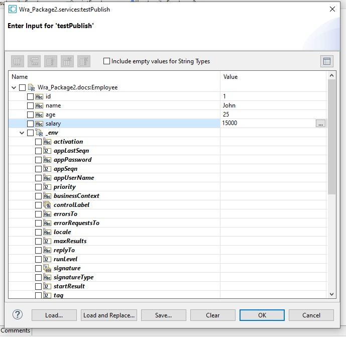
2. Check the log of the `printEmployee` and `printEmployee2` flow services in the webMethods Integration Server console log. \
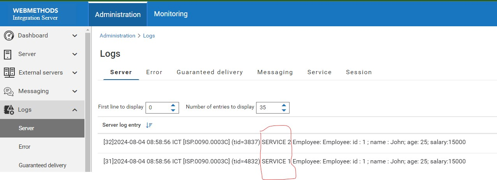 \
As you can see, the message is published to both `printEmployee` and `printEmployee2` flow services.

## Summary
In this sample, we have demonstrated how to publish messages to multiple subscribers using universal messaging. We created a document type `Employee`, and published it to two subscribers `printEmployee` and `printEmployee2` flow services. The message is published to both subscribers successfully.