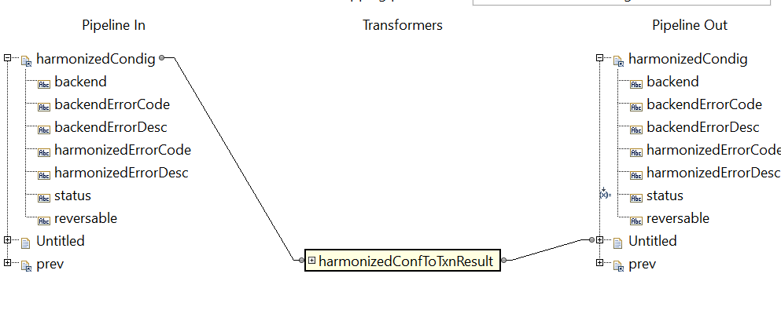

# Notes When You Are Developing With WebMethod Software AG

## Be aware when you assign static value in a document and use that document for the input of transformer
For Example

as you can see the `harmonizedCondig/status` is set to `xyz` in this map, even though in the previous map it's set to `success`.
the assignment static value in the same map affects the value passed to `harmonizedConfToTxnResult` transformer.