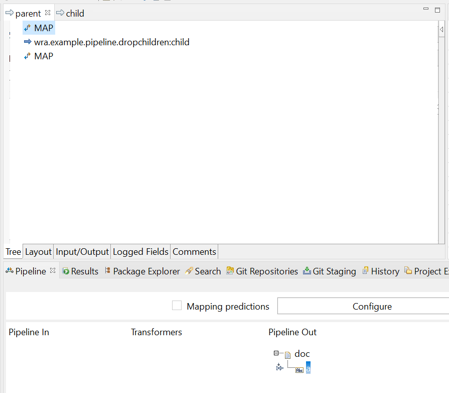
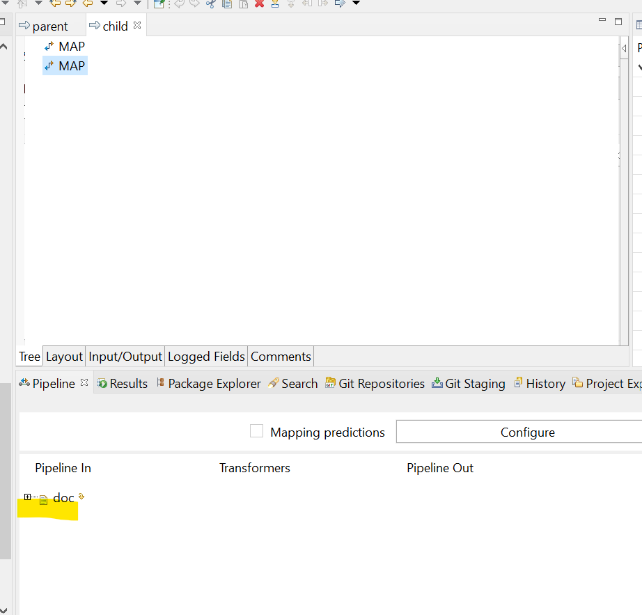
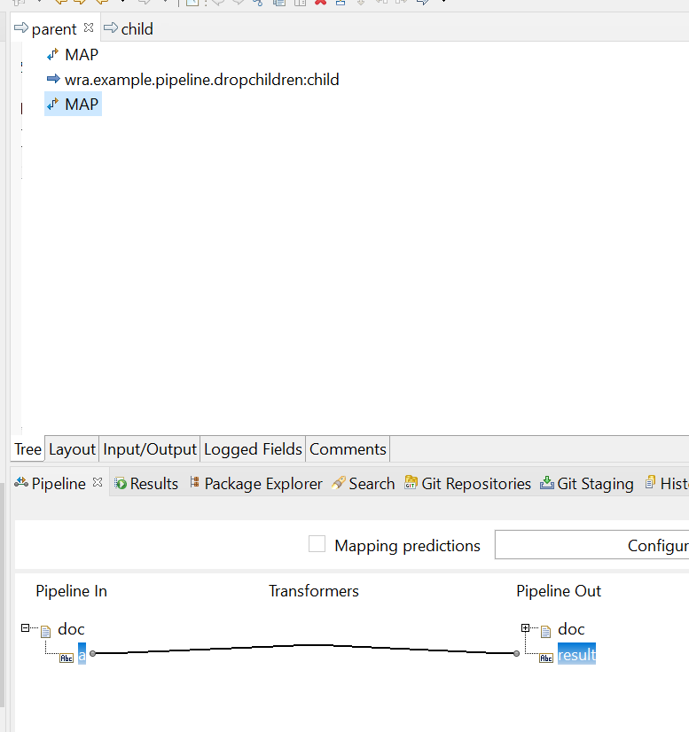
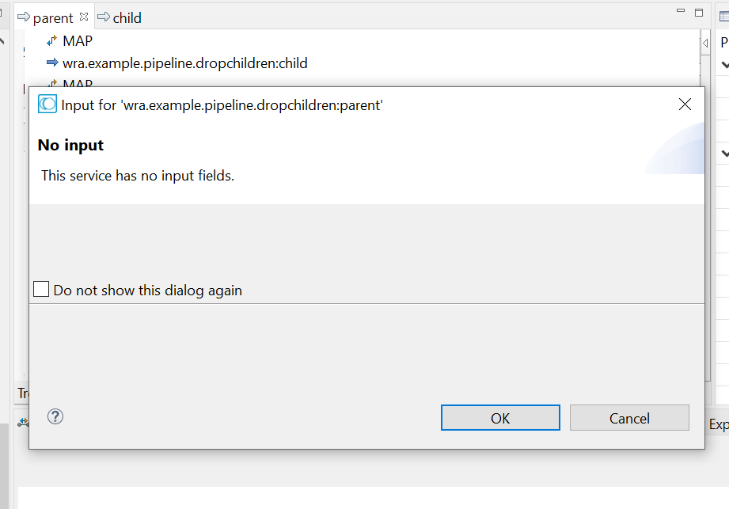
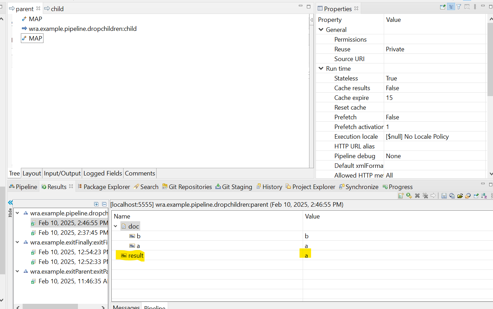

- drop value in the dependendt doesn't drop value in the caller even though the name of the variables is the same. except if you change the value of the same name

1. init `doc` that have the same name with the dependent service

2. call the dependent service

3. in the dependent service it will add filed `b` and drop the doc, to see if the `doc` is still available in the parent service.

4. in the last step of parent service we set the `result` from `doc/a` to make sure that the `doc` is still exist even though we have dropped it in the child

5. run the service

as you can see, the `result` contain value `a` indicated that the `doc` is still exist even though we have drop it in the dependent service. and also the field and value of `doc/b` is added as a change in the dependent service