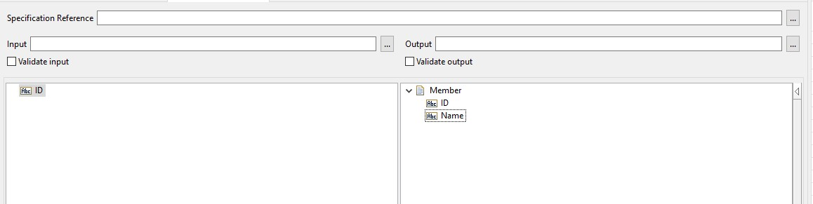
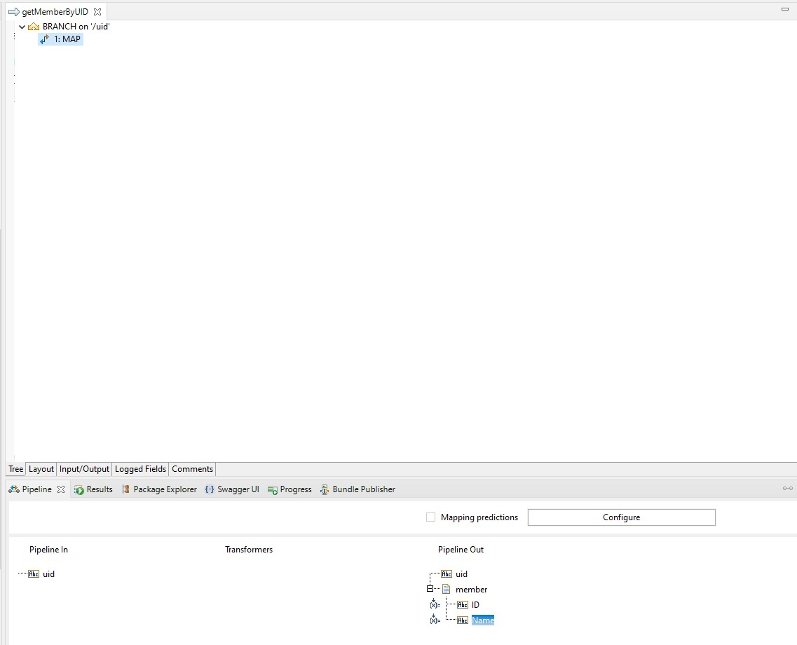
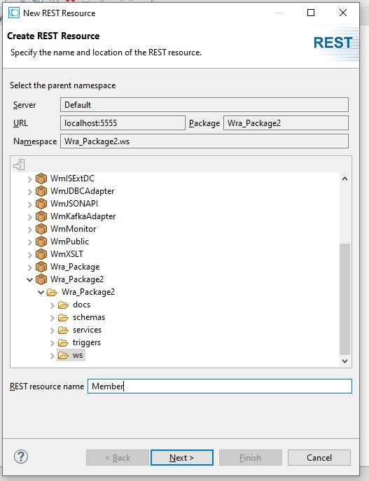
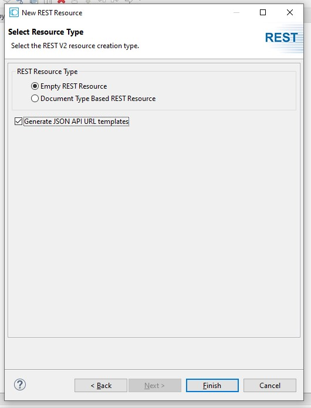
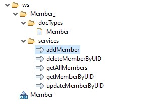
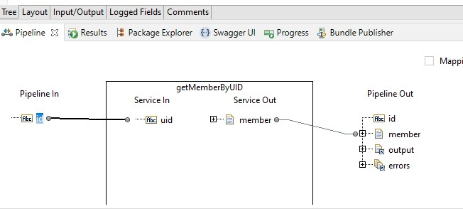
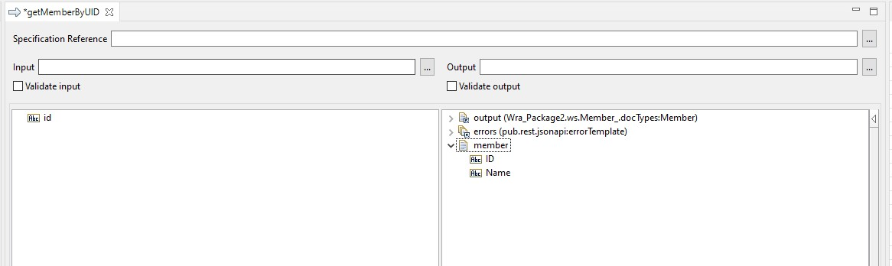
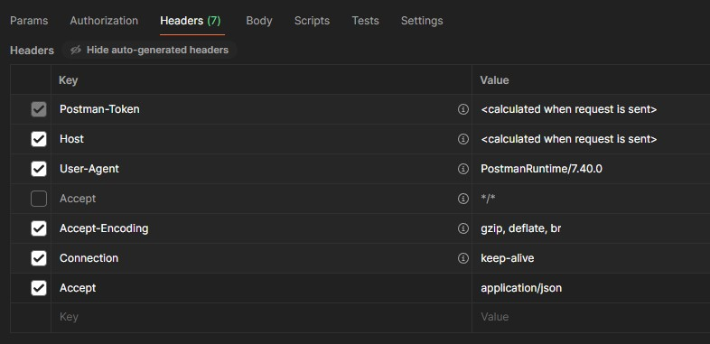
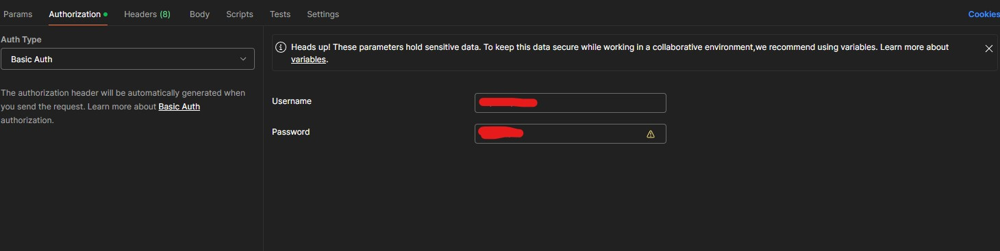
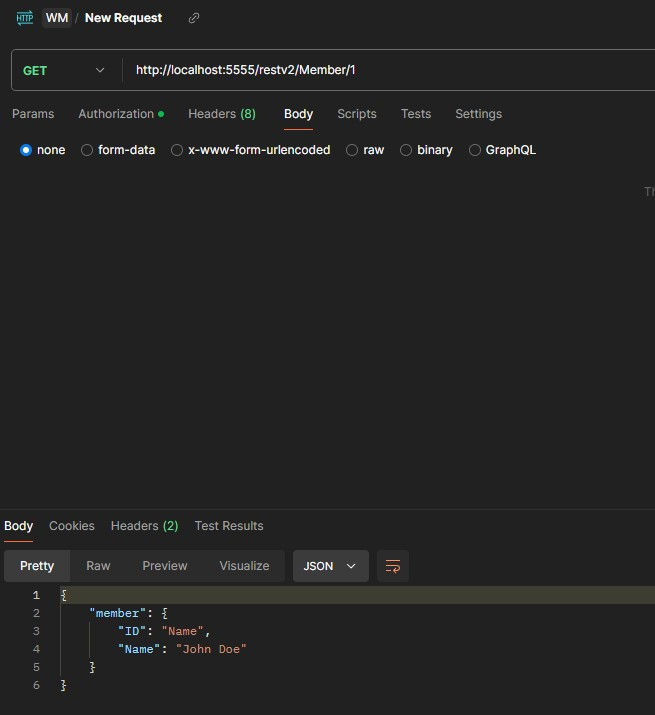

# Create Simple REST API using Rest Resourc V2

## Create a Flow Service
Before creating a REST API, we will create a simple flow service that will be used to implement the REST API. This flow service will be used to get a member by its UID.
1. Create a new flow service, name it `getMemberByUID`.
2. Add an input parameter `uid` of type `String` and an output parameter `member` of type `Document`. \

3. Add a `BRANCH` step, and configure the `Switch` property to `uid`
4. Add a `MAP` step inside the `BRANCH` step. configure the `Label` to `1`, and fill in the output `member` with the following values:
```
ID : 1
Name : John Doe
```
5. Save the flow service, the final flow service should look like this: \


## Generate REST API Templates
1. Right click on the folder where you want to create the REST API and select New > Rest Resource.
2. If the `Select Resource Type` dialog appears, select `REST V2 Resource` and click `Next`.
3. Enter the name of the resource, for this example, enter `Member` and click `Next`. \

4. In the `Rest resource type` section, select `Empty REST resource`, and check the `Generate JSON API URL templates` checkbox. Click `Finish`. \

5. The `Member` resource templates are created automatically. \


## Implement REST API
Now we are going to implement one of the created templates, that is `getMemberByUID`. This template is used to get a member by its UID.
1. Open the generate `getMemberByUID` flow service Template.
2. Drag and drop the `getMemberByUID` flow service that we created earlier into this flow service.
3. Map the `id` input parameter from the rest service to the `uid` input parameter of the flow service. \

4. Copy the `member` document that is returned by the flow service to the output of the rest service, so it can be shown in the response. \

5. Save the rest service. 

## Test REST API
1. Using postman, send a GET request to the following URL: `http://localhost:5555/restv2/Member/1`. \
2. Make sure you have set the `Accept` header to `application/json`. \

3. Make sure you have set the basic authentication with the username and password of the IS server. \

4. Send the request, you should get the following response: \
