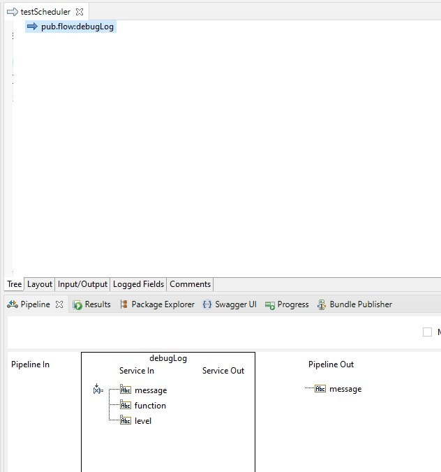
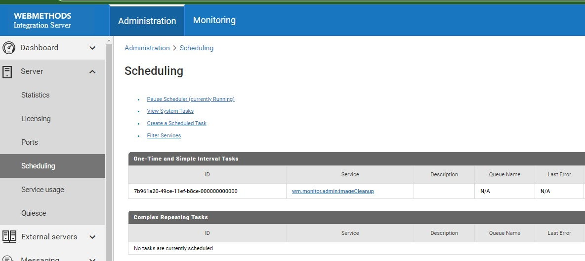
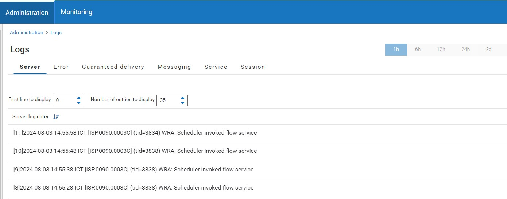

# Create Scheduler
In this example, we will create a scheduler that will run every 10 seconds.

1. Create a flow service that will be executed by the scheduler. In this example, we will create a simple flow service that will log a message to the console. Let's name it `testScheduler`.
2. Add a `pub.flow:debugLog` step to the flow service, and set the message to `WRA: Scheduler invoked flow service`, and save the flow service.

3. Login to webMethods Integration Server via the browser, navigate to the `Server` section and select `Scheduling`.

4. Click on the `Create a Scheduled Task` and set the configuration as follows:
   * Description: `Test Scheduler`
   * folder.subfolder:service: the flow service that will be executed by the scheduler, for example `folder.subfolder:testScheduler`
   * Run As User : Select the user that will run the scheduler, for example `Administrator`
   * If the Task is Overdue : Select `Run Immediately`
   * Schedule Type and Details: Select `Repeating` and set the interval to `10` seconds
   * Save Task
5. The scheduler will run every 10 seconds and will log the message to the console. Check the server log to see the message.
