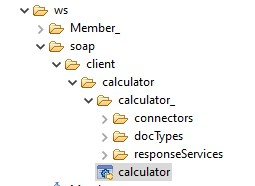
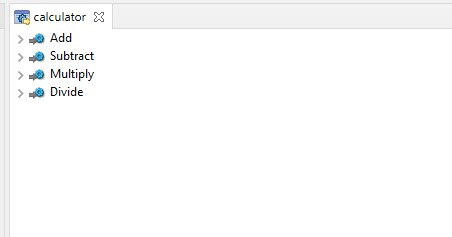
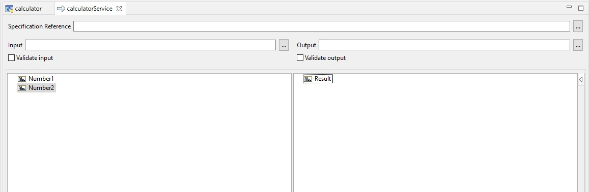
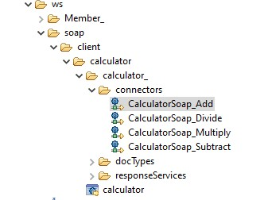
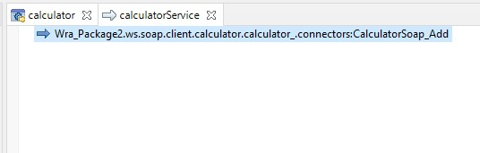
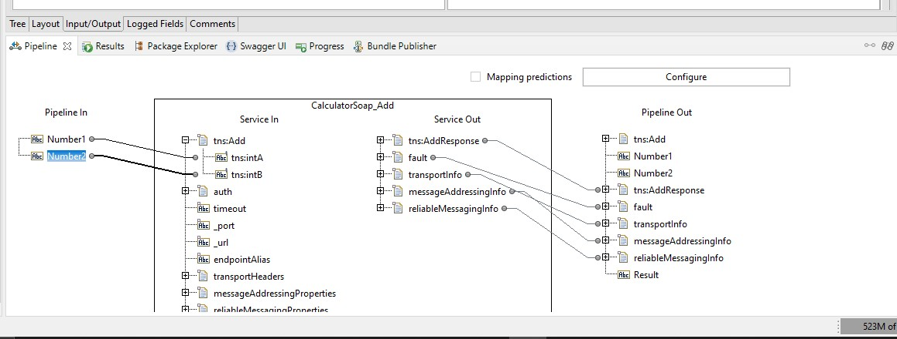
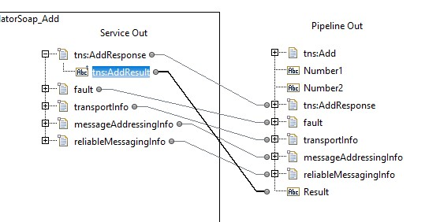
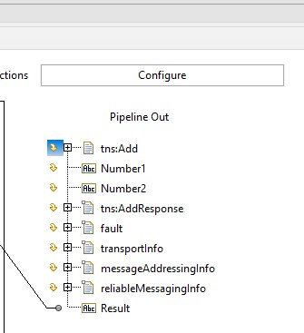
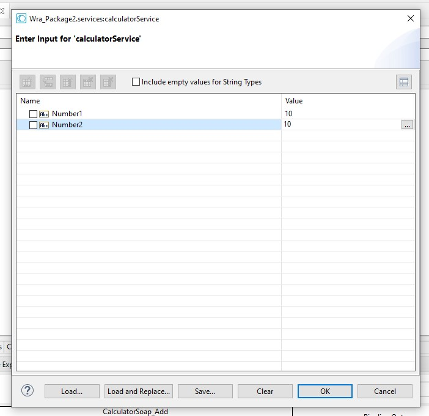
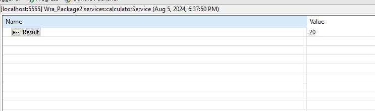

# Soap Client Example

This example demonstrates how to create a SOAP client using the `ws` module.

## Create the SOAP client
1. Right click on the folder that you want to create the SOAP client, New > Web Service Descriptor
2. Name it `calculator` and click `Next`
3. In the `Select the Source Type` dialog box, select `Consumer`, and Web service source as `WSDL`. Afetr that, click `Next`
4. In the `Source location` select `File/URL` and input this URL `http://www.dneonline.com/calculator.asmx?wsdl`. After that, click `Next`
5. Leave everything as default and click `Next`
6. Click `Finish`, and the `calculator` soap client will be generated automatically. \

## Call the SOAP client in the Flow Service
1. Create a new flow service, name it `calculatorService`
2. Create two input parameters, name them `Number1` and `Number2`. Then create an output parameter, name it `Result` \

3. Drag and drop the connector, in this example we use `Wra_Package2.ws.soap.client.calculator.calculator_.connectors:CalculatorSoap_Add`
 
4. Map the `Number1` to `tns:Add/tns:intA` and `Number2` to `tns:Add/tns:intB` \

5. Map the `tns:AddResponse/tns:AddResult` to `Result` \

6. (Optional) you can drop all the unnecessary values \

7. Save and run the flow service, and you will get the result \
 