# Create Simple SOAP Server

## Create a flow service
This flow service will be published as a SOAP service. It will accept 2 input parameters then add them together and return the result.
1. Create a new flow service called `addNumbers`.
2. Add 2 input parameters to the flow service called `num1` and `num2`, then add a `result` output parameter. \
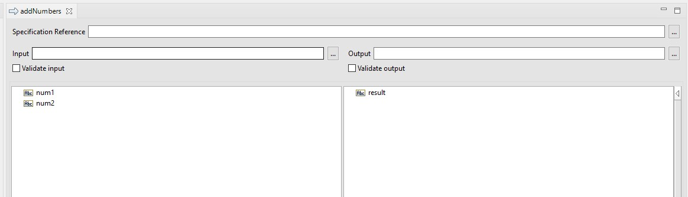
3. Add `pub.math:addInts` to the flow service.
4. Since the name of input parameters is the same as the input parameters of `pub.math:addInts`, it will automatically map the input parameters. But we need to map the output parameter of `pub.math:addInts` to the `result` output parameter. And we can drop any unnecessary parameters. The final flow service should look like this: \
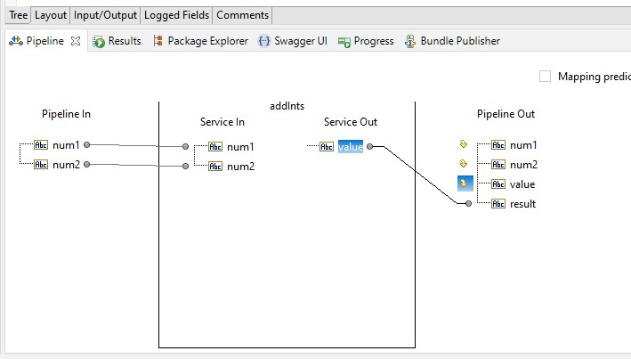
5. Add a `pub.flow:debugLog` to the flow service to log the result. And set the `logMessage` to `result: %result%`. Make sure you check the `Perform pipeline variable substitution` checkbox. \
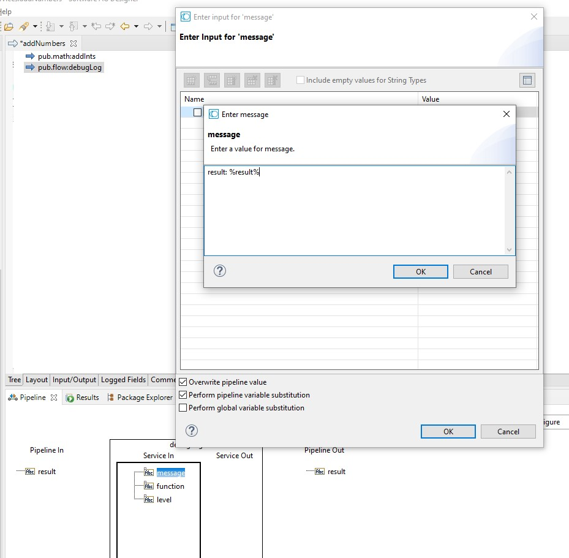
6. Save the flow service.

## Expose the flow service as a SOAP service
1. Right-click on the folder where the SOAP service will be created, then select `New > Web Service Descriptor`. \
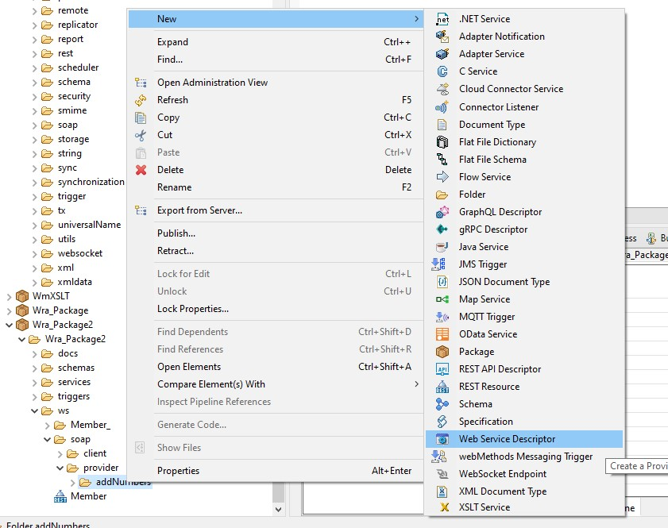
2. Enter the name of the web service descriptor as `addNumbers`. And click `Next`.
3. In `Create web service descriptor as` section, select `Provider`. And in `Web service source` section, select `Existing IS service(s)`. After that, click `Next`. \
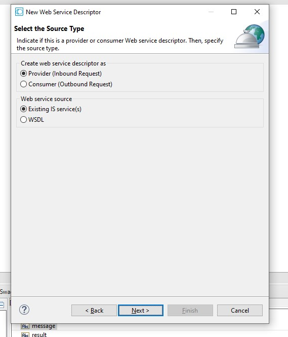
4. Select the `addNumbers` flow service that we created earlier. Then click `Next`. \
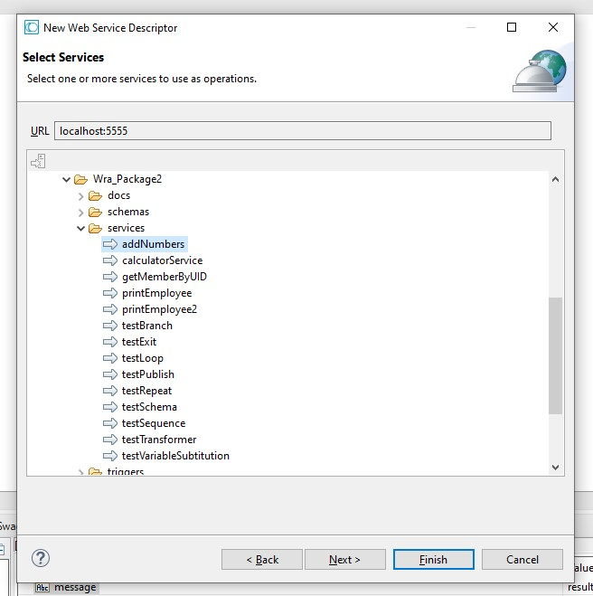
5. leave the default settings and click `Finish`. \
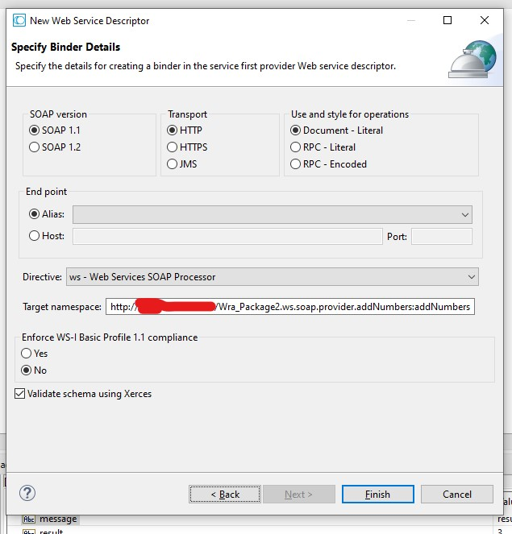
6. The `addNumbers` SOAP service has been created. \

## Test the SOAP service
1. In the `addNumbers` SOAP service page, click on the wsdl tab. Copy the wsdl, paste and save it as a file. \
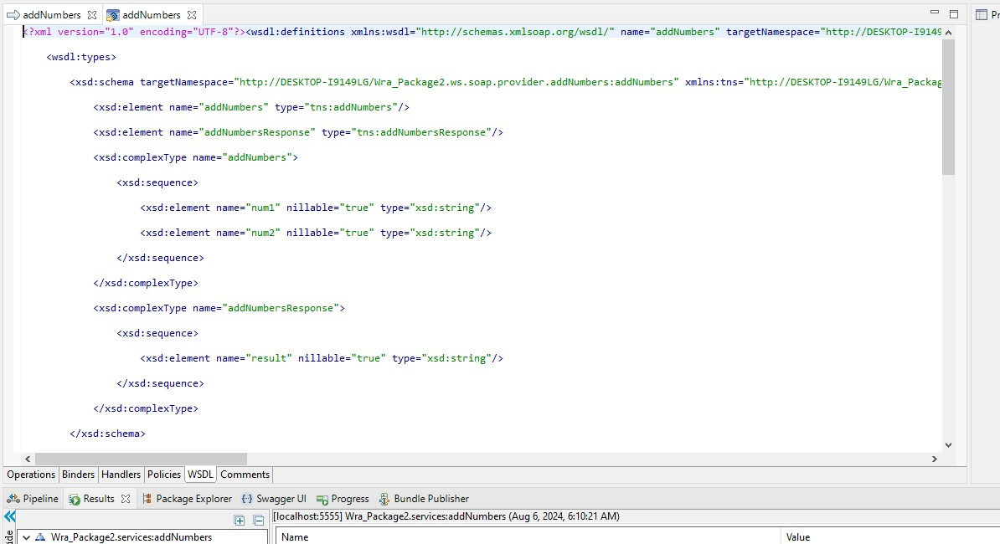
2. Create a new SOAP project in SoapUI. \
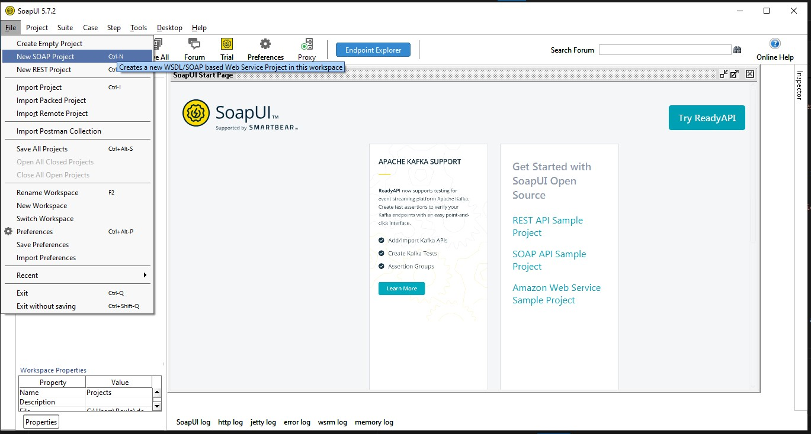
3. Name the project as `addNumbers`. And import the wsdl file that we saved earlier. Then click `OK`. \
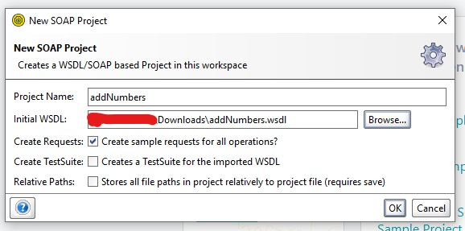
4. Click on the `Request 1`
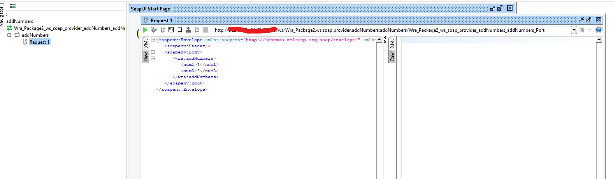
5. Enter the value for `num1` and `num2`. Let's say `num1` is `5` and `num2` is `10`. 
6. Now we need to set the authentication. Click on the `Auth` tab. Select `Add New Authorization` and select `Basic` as the type. Then click `OK`. \
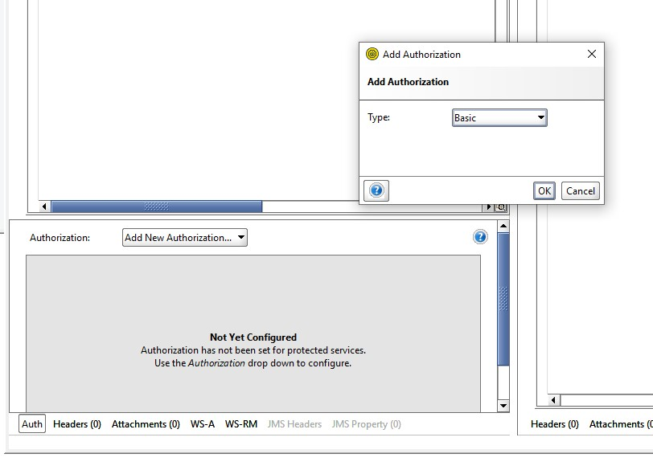
7. Enter the username and password.
8. Click on  to send the request. 
9. The response should be `result: 15`. \
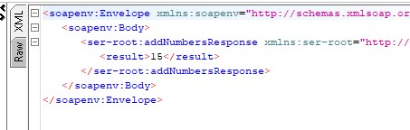