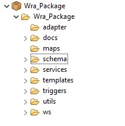

# Structure Folder Suggestion

It's recommended that the package name is the same as the folder name.

## adapter
It contains the adapter services, like if you want to connect to any systems or a database system.

## docs
To keep all your documents or if you're importing XML structure or flat file structure, you can create under this docs folder.

## maps
This is to keep all your mapping services. For example mapping from one format of structure to another format, XML to another XML, or XML to flat file structure.

## schema
This is the place you can keep your XML schema whic is XSD, and also flat file schema. If you're going to do any validation for the incoming document, those kind of schema, you can keep it here.

## services
Mainly to keep all your flow services.

## triggers
Mainly to keep your trigger or the normal broker trigger.

## utils
Mainly for your utility related services. If you have any reusable services which you want to use it for many packages or many services, then you can keep it here.