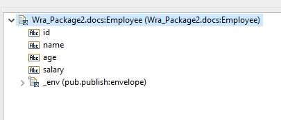
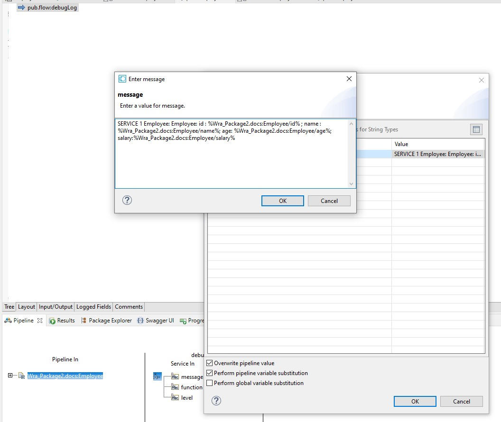

# Example of variable substitution from document field

1. Let's say we have a document type like this: \

2. To perform variable substitution from the document field, you can use this format `%documentTypeName/fieldName%`. For example, if you want to get the value of the `name` field, you can use `%Wra_Package2.docs:Employee/name%`. \

3. Make sure the `Perform pipeline variable substitution` is checked.