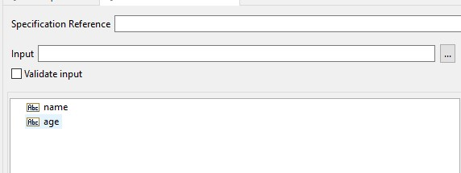
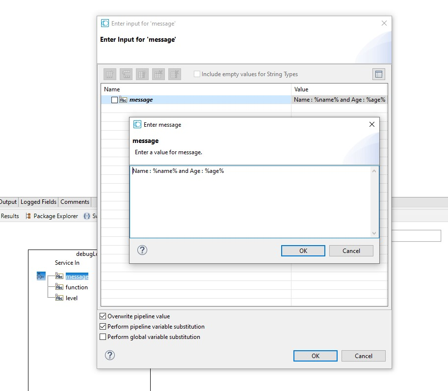
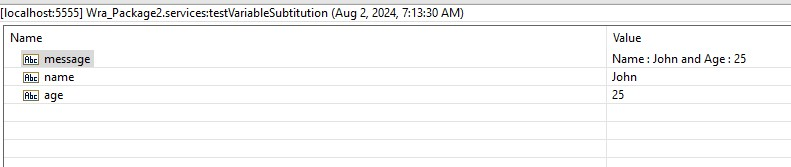

# Perform Pipeline Variable Substitution

This is a simple example of how to perform pipeline variable substitution using `%variable%` in a flow service.

1. Create a flow service, add 2 strings input `name` and `age` \

2. Add `pub.flow:debugLog` service to the flow service, set the `message` to `Name : %name% and Age : %age%`, make sure you checked the `Perform pipeline variable substitution` checkbox. \

3. Run the flow service, and provide the input values for `name` and `age`. \
