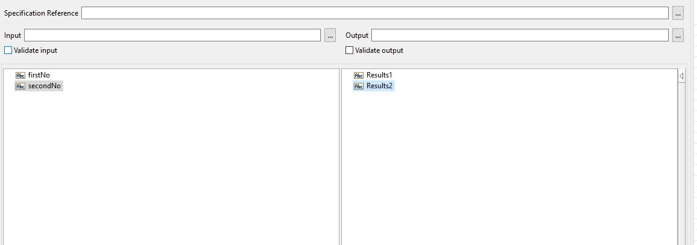
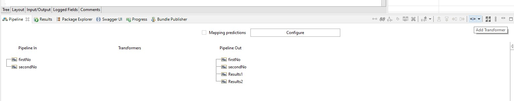
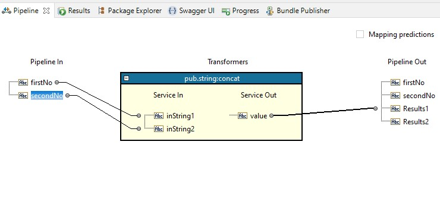
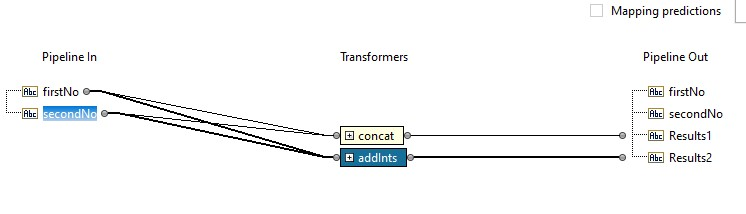
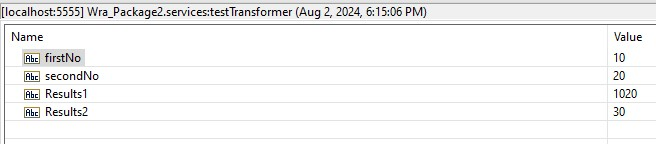

# Transformer Example

1. Create 2 input and 2 output. Name them `firstNo`, `secondNo`, `Results1`, `Results2` \

2. Add `MAP` and do the following:
    * add `pub.string:concat` transformer
    
    * map the `firstNo` and `secondNo` to the `inString1` and `inString2` respectively
    * map the `value` to `Results1`
    * The final mapping should look like this: \
    
    * add `pub.math:addInts` transformer
    * map the `firstNo` and `secondNo` to the `num1` and `num2` respectively
    * map the `value` to `Results2`
    * The final mapping should look like this: \
    
3. Run the service. set the `firstNo` to `10` and `secondNo` to `20`. It should result like this: \
