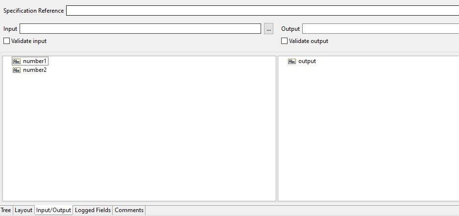
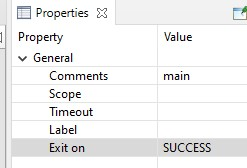
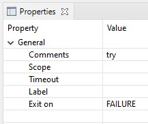
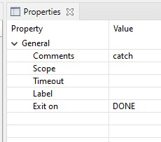
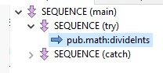
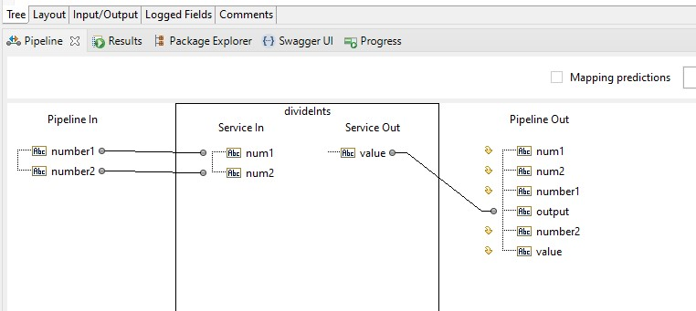
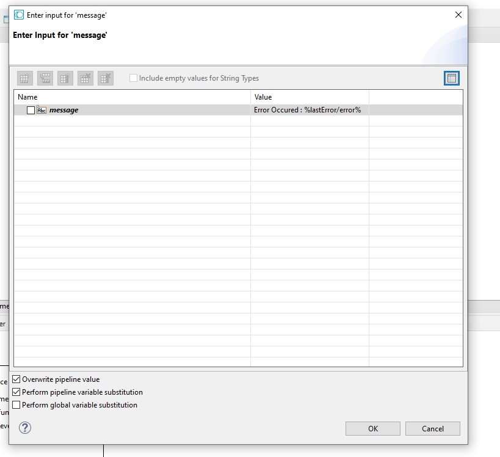
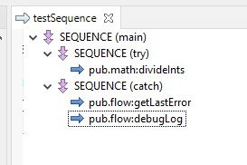
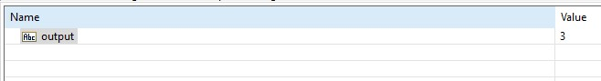
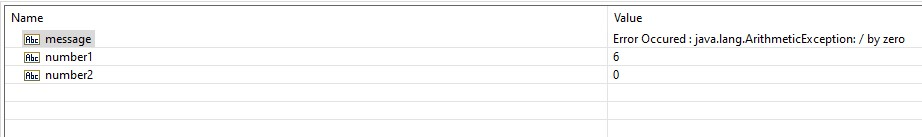

# Try Catch Using Sequence
This is a simple example of how to use the `try-catch` block in a sequence.

1. add 2 strings input `number1` and `number2` and 1 string output `output` \

2. Add a sequence, set the `comment` to `main` and set `exit on` to `SUCCESS` \
 

3. In the sequence, add another two sequences, for the first sequence set the `comment` to `try` and `exit on` to `FAILURE`. The first sequence will be the `try` block. \
 \
For the second sequence, set the `comment` to `catch` and `exit on` to `DONE`. The second sequence will be the `catch` block. \

4. Add `pub.math:divideInts` flow service to the `try` block, and make sure you have mapped the inputs and outputs. \
 \

5. add `pub.flow:getLastError` and `pub.flow:debugLog` flow services to the `catch` block. In the `pub.flow:debugLog` service, set the `message` to `Error Occured : %lastError/error%`, make sure you checked the `Perform pipeline variable substitution` checkbox. \
 \

6. This is the final flow service looks like. \

7. To run the success scenario, set the `number1` to `10` and `number2` to `2` \
 \
To run the failure scenario, set the `number2` to `0`. \
 \