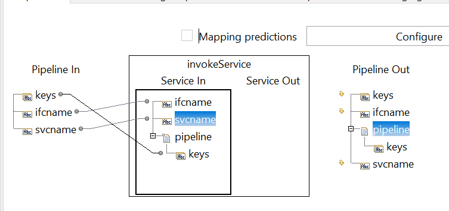
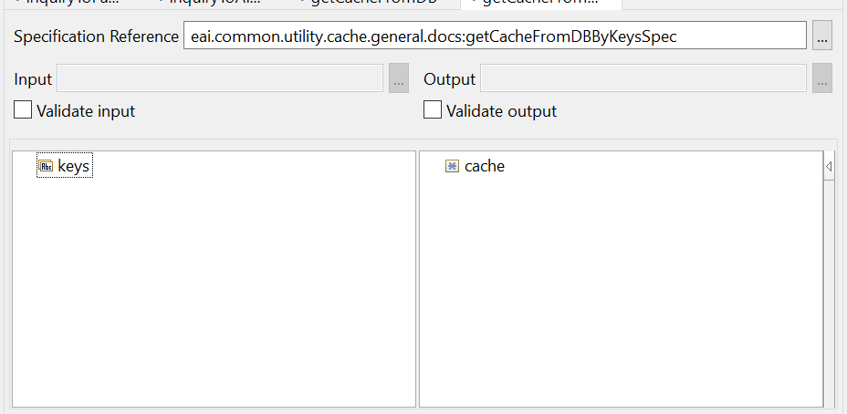
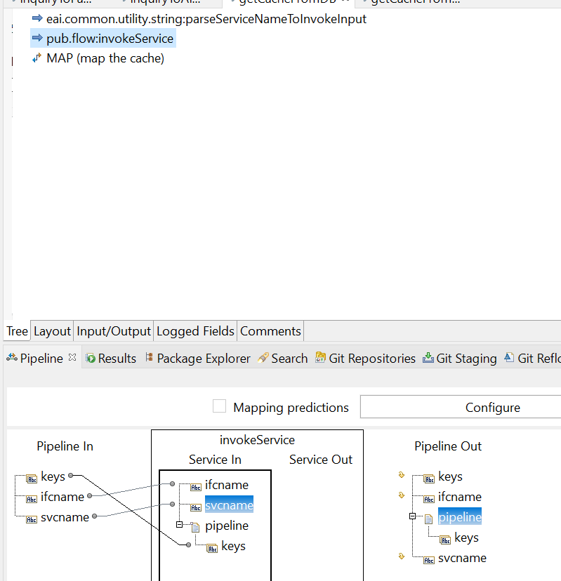
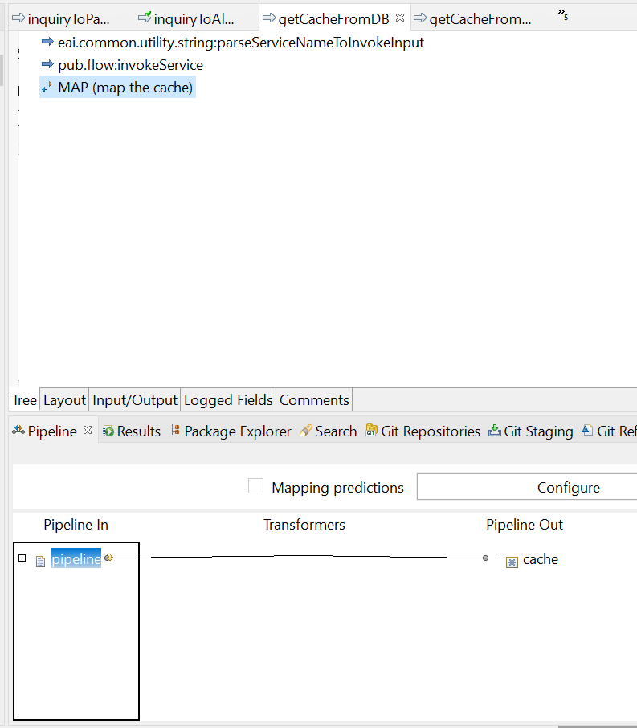

# Example to use pub.flow:invokeService

## `ifcname` & `svcname`
- to use `pub.flow:invokeService` you need to fill the `ifcname` and the `svcname`.
    - `ifcname` is the path before the service name.
    - `svcname` is the service name.
    - so if you have service name `pub.math:addInts` the `ifcname` = `pub.math` & `svcname` = `addInts`

## Pass parameter to `pub.flow:invokeService`
- to pass parameter in the `pub.flow:invokeService` you can create the variable and pass it to `pipeline` doc, for example:

    - in this example we created `keys` input param

## Get output from `pub.flow:invokeService`
- the previous example pub.flow:invokeService will invoke the service that have this input & output


- to get the input from the executed service you can add it in the new map, and pass it to the new variable. for example
 \


## Tips
to separate service from path to service you can use this code
```java
public static final void parseServiceNameToInvokeInput(IData pipeline) throws ServiceException {
    // pipeline
    IDataCursor pipelineCursor = pipeline.getCursor();
        String	fullPathServiceName = IDataUtil.getString( pipelineCursor, "fullPathServiceName" );
    pipelineCursor.destroy();
    
    String[] tokens = fullPathServiceName.split(":");
    
    if (tokens.length > 1) {
        // pipeline
        IDataCursor pipelineCursor_1 = pipeline.getCursor();
        IDataUtil.put( pipelineCursor_1, "ifcname", tokens[0] );
        IDataUtil.put( pipelineCursor_1, "svcname", tokens[1] );
        pipelineCursor_1.destroy();
    }
}
```